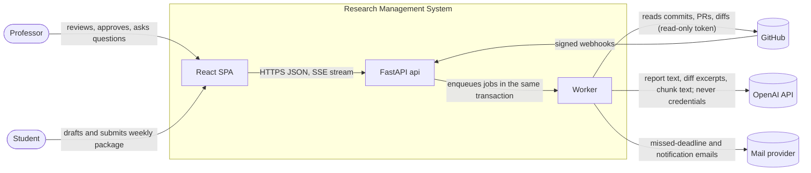
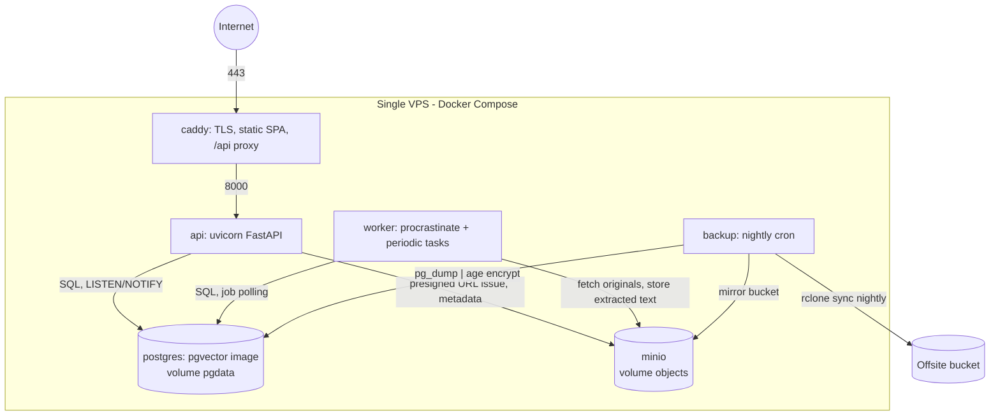
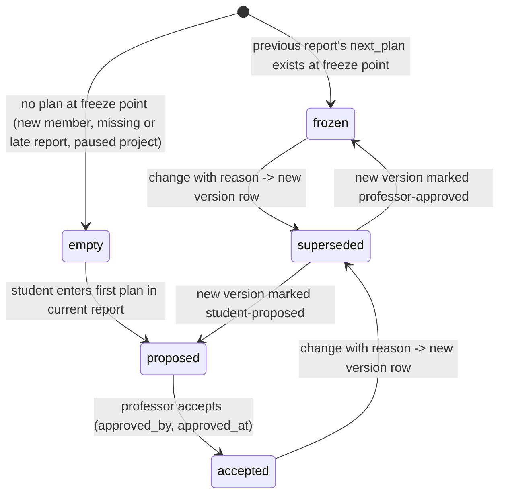
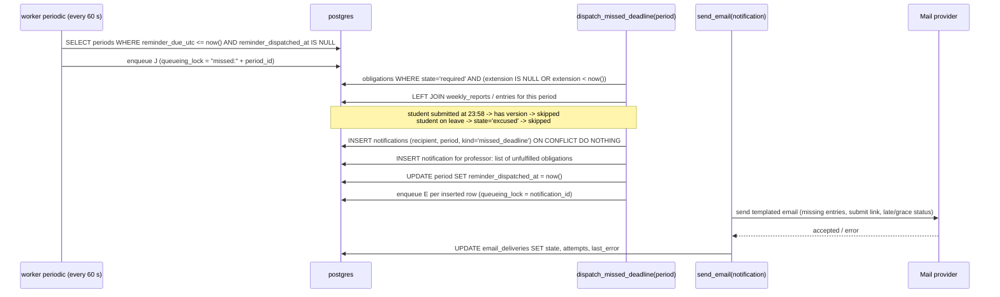
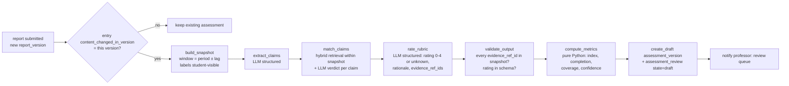
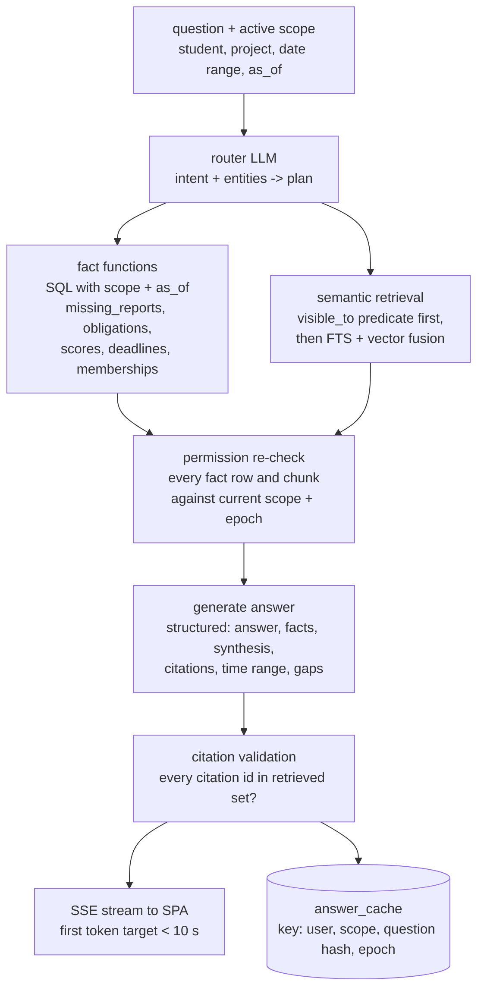

# Research Management System — Architecture

Version 0.1 — 11 September 2026 — implements [research_management_requirements.md](research_management_requirements.md) v0.3

This document turns the logical boundaries in section 10 of the requirements into a concrete design. Each section names the requirement IDs it satisfies; section 16 maps every ID in the specification to the section that covers it.

## 1 Purpose, scope, and fixed decisions

| Decision | Choice | One-line reason |
| --- | --- | --- |
| Backend | Python 3.12, FastAPI, SQLAlchemy 2, Alembic, Pydantic v2 | Matches the team's existing FastAPI projects |
| Frontend | React 18, Vite, TypeScript, TanStack Query, shadcn/ui | Same toolchain as the graph-digitizer frontend |
| Database | PostgreSQL 16 with `pgvector` and built-in full-text search | One store for records, search, vectors, and the job queue |
| Jobs | procrastinate (Postgres-backed queue) running periodic tasks in the worker | Transactional enqueue; no Redis to operate |
| Files | MinIO (S3 API) on the same host | Presigned uploads, versioned bucket, easy offsite mirror |
| LLM | OpenAI GPT API (responses + embeddings) behind one internal gateway module | Vendor isolated to one module; swappable |
| Repository provider | GitHub App first; GitLab through the same connector protocol | Fine-grained read-only installation tokens, signed webhooks |
| Hosting | Single VPS, Docker Compose, Caddy for TLS | 50 students and 30 projects fit one host with headroom |

Out of scope for this document: UI visual design, exact prompt texts, and institutional SSO (deferred per section 12 of the requirements).

## 2 System context



What crosses the boundaries matters for the AI data boundary (requirements section 11): only the worker talks to OpenAI, and only with content the gateway has assembled from the permission-labelled snapshot. Credentials, supervision notes, and other students' private reports never leave the host.

## 3 Deployment view



Service notes:

- **caddy** terminates TLS with automatic certificates, serves the built SPA, and proxies `/api/*` to `api`. No CORS because the SPA and API share an origin.
- **api** and **worker** run the same image with different commands. The worker also runs the periodic tasks (section 12), so there is no separate scheduler container.
- **postgres** uses the `pgvector/pgvector:pg16` image. One volume. `shared_buffers` and `work_mem` tuned for the host; the queue and the records share the instance.
- **minio** holds one versioned bucket per environment. The API never streams file bodies; it issues presigned PUT and GET URLs after an authorization check.
- **backup** runs nightly `pg_dump -Fc`, encrypts with `age`, mirrors the MinIO bucket, and syncs both to an offsite bucket with `rclone`. Retention 30 daily and 12 monthly. A restore drill against a scratch Compose stack is part of the launch checklist (AC-16).
- Health: `/api/healthz` (process up), `/api/readyz` (DB and MinIO reachable, queue lag under threshold). Compose `restart: unless-stopped`.
- Secrets live in a root-owned `.env` file with mode 600 and are injected as environment variables. Provider credentials (GitHub App private key, OpenAI key, SMTP password) are referenced by name in application records and never stored in the database (requirements section 9).

## 4 Code layout

### 4.1 Backend: modular monolith

```
backend/
  app/
    core/           config, db session, migrations hook, authz (Scope, visible_to), audit, jobs (procrastinate app), clock
    identity/       users, invitations, sessions, break-glass CLI
    projects/       projects, memberships, milestones, tasks, plan_baselines
    reporting/      reporting_periods, obligations, weekly_reports, report_versions, entries, artifacts
    evidence/       repositories, connectors/{base,github}.py, developer_identities, repository_events, contributions,
                    evidence_references, index/ (chunking, embeddings, fts)
    assessment/     rubrics, snapshot.py, pipeline/ (claims, matching, rating), metrics.py, versions, review
    assistant/      router.py, facts/ (SQL fact functions), retrieval.py, answer.py, conversations
    notifications/  notifications, email/{base,smtp}.py, templates, scheduler_tasks.py
    ai/             gateway.py, prompts/ (registry with versions), schemas/ (structured outputs), cost.py, redaction.py
    api/            one router per module, dependency wiring, SSE helpers
  tests/
  alembic/
```

Dependency rule, enforced by an import-linter contract in CI:

```
core → identity → projects → reporting → evidence → assessment → assistant
notifications → reporting          (and core)
ai ← assessment, ai ← assistant    (no other module may import ai)
```

A module reads another module's data only through that module's `service.py`; it never imports another module's ORM tables into its own queries. This keeps the authorization filter (section 6) in one place per aggregate.

### 4.2 Frontend routes

| Route | Screen | Requirement |
| --- | --- | --- |
| `/overview` | Professor overview: current week, missing/late, review queue, attention list, sync issues | UI-01 |
| `/me` | Student overview: obligations, draft state, next deadline, released feedback, timeline | UI-02 |
| `/projects/:id` | Project workspace: goals, members, milestones, artifacts, repositories, decisions | UI-03 |
| `/students/:id` | Student research profile (professor); permitted subset at `/me/profile` | UI-04 |
| `/review/:assessmentId` | Review workspace: claims, evidence, draft assessment, freshness, approve/override | UI-05 |
| `/exports` | Filtered exports with approval status | UI-06 |
| `/notifications` | In-app notification list and mute settings | UI-07 |
| `/report/:periodId` | One weekly submission flow with a tab per required project entry | REP-02, REP-03 |
| `/assistant` | Professor assistant with visible active scope and streaming answers | QA-01…QA-07 |

## 5 Data architecture

### 5.1 Table groups

| Group | Tables |
| --- | --- |
| Identity | `workspaces`, `users`, `invitations`, `sessions`, `password_resets`, `audit_events` |
| Projects | `projects`, `project_memberships`, `milestones`, `milestone_revisions`, `tasks`, `plan_baselines`, `plan_baseline_items`, `research_decisions` |
| Reporting | `calendar_configs`, `reporting_periods`, `reporting_obligations`, `weekly_reports`, `report_versions`, `project_report_entries`, `revision_requests`, `artifacts`, `artifact_versions` |
| Evidence | `repositories`, `project_repositories`, `developer_identities`, `repository_events`, `contributions`, `evidence_references`, `evidence_chunks`, `sync_runs` |
| Assessment | `rubric_versions`, `evidence_snapshots`, `evidence_snapshot_items`, `analysis_runs`, `assessment_versions`, `assessment_reviews`, `feedback`, `supervision_notes` |
| Assistant | `conversations`, `messages`, `answer_cache` |
| Operations | `notifications`, `email_deliveries`, `ai_calls`, `procrastinate_*` (queue, managed by the library) |

Every table carries `workspace_id`; composite foreign keys `(workspace_id, x_id)` enforce the same-workspace invariant from requirements section 9.

### 5.2 Central tables

Types abbreviated. `id` columns are UUIDv7 unless noted. All timestamps are `timestamptz` in UTC.

**users** — `id, workspace_id, role ENUM(prof, student), email UNIQUE, display_name, password_hash, state ENUM(invited, active, deactivated), deactivated_at, created_at`

**project_memberships** — `id, workspace_id, project_id, student_id, responsibility, joined_on DATE, left_on DATE NULL, first_required_period_id NULL, last_required_period_id NULL, planned_allocation NUMERIC NULL, created_at`
Constraint `uq_membership_active`: unique `(project_id, student_id)` where `left_on IS NULL`. `left_on` is exclusive — the first day the student is no longer a member — so ending a membership today revokes access today (AUTH-03), and a departure dated in the future keeps access until it arrives.

**calendar_configs** — `id, workspace_id, version INT, timezone TEXT, meeting_weekday SMALLINT, week_start_weekday SMALLINT, grace_minutes INT, effective_from DATE, created_by, created_at`
The deadline is not stored here; it is derived per period (section 7).

**reporting_periods** — `id, workspace_id, calendar_config_id, local_start DATE, local_end DATE, start_utc, end_utc, meeting_date DATE, deadline_utc, reminder_due_utc, reminder_dispatched_at NULL`
Constraint `uq_period_start`: unique `(workspace_id, local_start)`. `deadline_utc` is 23:59:00 local on `meeting_date - 1 day`. `reminder_due_utc = deadline_utc + interval '60 seconds'`.

**reporting_obligations** — `id, workspace_id, membership_id, period_id, state ENUM(required, excused), excuse_reason, extension_until_utc NULL, created_at`
Constraint `uq_obligation`: unique `(membership_id, period_id)`.

**weekly_reports** — `id, workspace_id, student_id, period_id, workflow_state ENUM(draft, submitted, revision_requested, resubmitted, reviewed), first_submitted_at NULL, current_version_id NULL, draft_content JSONB, draft_saved_at`
Constraint `uq_report`: unique `(student_id, period_id)`. `first_submitted_at` is written once and never updated (REP-07, AC-13); the `freeze_first_submitted_at` trigger raises on any change after it is set.

**report_versions** — `id, workspace_id, report_id, version_no INT, author_id, submitted_at, idempotency_key TEXT, timing_status ENUM(on_time, late, excused)`
Constraints `uq_report_version (report_id, version_no)`, `uq_report_idem (report_id, idempotency_key)`. Immutable (section 5.3).

**project_report_entries** — `id, workspace_id, report_version_id, project_id, stage, milestone_ids UUID[], planned_work_ref, work_performed TEXT, results TEXT, experiments JSONB, deviations TEXT, next_plan JSONB, questions TEXT, evidence_refs JSONB, hours NUMERIC NULL, content_hash BYTEA, content_changed_in_version_id`
Constraint `uq_entry (report_version_id, project_id)`. `content_hash` is SHA-256 over the canonical JSON of the entry fields excluding `hours`. On resubmission, if the hash equals the previous version's entry, `content_changed_in_version_id` is copied forward; otherwise it is set to the new version. Immutable.

**plan_baselines** — `id, workspace_id, membership_id, period_id, version_no INT, state ENUM(frozen, empty, proposed, accepted, superseded), frozen_at, source_entry_id NULL, change_reason TEXT NULL, proposed_by NULL, approved_by NULL, approved_at NULL`
Constraint `uq_baseline_in_effect`: unique `(membership_id, period_id)` where `state IN ('frozen','accepted')`. Rows are immutable; a change inserts a new version and marks the old one `superseded` through a new row, never an update. `plan_baseline_items` holds `(baseline_id, task_id, planned_outcome, weight NUMERIC, acceptance_criteria)`.

**evidence_references** — `id, workspace_id, project_id, owner_student_id NULL, visibility ENUM(professor_only, student_private, project_shared), source_kind ENUM(report_entry, artifact_version, repository_event, decision, feedback), source_id, source_version TEXT, locator TEXT, supported_claim TEXT NULL, source_time, ingested_at`
Every indexed piece of evidence has exactly one row here, and `evidence_chunks` rows reference it. Visibility is copied from the source at ingestion and re-synced when the source changes.

**evidence_snapshots** — `id, workspace_id, student_id, project_id, period_id, window_start_utc, window_end_utc, integration_lag_days INT, built_at, item_count INT, coverage_notes JSONB`
`evidence_snapshot_items` — `(snapshot_id, evidence_ref_id, source_version)`, primary key on both. Built only from `evidence_references` with `visibility <> 'professor_only'` and whose student-visible test passes for `student_id`. The builder never touches `supervision_notes` (ASSESS-01, QA-06).

**assessment_versions** — `id, workspace_id, student_id, project_id, period_id, version_no INT, report_version_id, entry_id, baseline_id NULL, snapshot_id, rubric_version_id, ratings JSONB, progress_index SMALLINT NULL, plan_completion NUMERIC NULL, coverage_pct NUMERIC, confidence ENUM(high, medium, low), confidence_reasons JSONB, narrative JSONB, model_name, prompt_versions JSONB, analysis_run_id, created_at`
Constraint `uq_assessment_version (student_id, project_id, period_id, version_no)`. Immutable. `ratings` stores per-dimension `{rating: 0-4|"unknown"|"not_applicable", rationale, evidence_ref_ids[]}`.

**assessment_reviews** — `id, workspace_id, assessment_version_id, state ENUM(draft, approved, superseded, withdrawn), reviewer_id, override JSONB NULL, rationale TEXT NULL, published_at NULL, created_at`
Constraint `uq_one_approved`: unique `(assessment_version_id)` where `state = 'approved'`. Students read only versions with an `approved` review.

### 5.3 Immutability and audit

Tables `report_versions`, `project_report_entries`, `plan_baselines`, `plan_baseline_items`, `evidence_snapshot_items`, `assessment_versions`, `repository_events`, `audit_events` get:

```sql
CREATE TRIGGER trg_immutable BEFORE UPDATE OR DELETE ON report_versions
  FOR EACH ROW EXECUTE FUNCTION raise_immutable();
```

The application layer also exposes no update path for these tables. Retention-driven deletion (section 15) runs as a privileged migration-style job that disables the trigger inside a single transaction and records an `audit_events` row.

`audit_events` — `id, workspace_id, actor_id NULL, actor_kind ENUM(user, system, job), action TEXT, target_table, target_id, before JSONB NULL, after JSONB NULL, request_id, occurred_at`. Every mutation goes through a service method that writes the audit row in the same transaction.

### 5.4 Invariants as constraints

| Requirement invariant | Constraint |
| --- | --- |
| Unique report per student–period | `uq_report` |
| Unique entry per report version–project | `uq_entry` |
| Unique obligation per membership–period | `uq_obligation` |
| One baseline in effect per membership–period | `uq_baseline_in_effect` |
| Idempotent external events | `uq_repo_event (repository_id, provider_event_id)` on `repository_events` |
| Immutable submitted and approved versions | `trg_immutable` triggers; `uq_one_approved` |
| Same-workspace foreign keys | Composite FKs including `workspace_id` |
| Explicit access labels on indexed evidence | `evidence_chunks.visibility NOT NULL`, FK to `evidence_references` |

### 5.5 Plan baseline lifecycle (PROJ-04, ASSESS-05)



The freeze point is `reporting_periods.start_utc` by default. A periodic task `freeze_baselines(period_id)` runs at period start and inserts a `frozen` or `empty` row per required obligation. Commitment completion (ASSESS-05) is computed only against rows in state `frozen` or `accepted`; otherwise the assessment shows completion as unavailable.

### 5.6 File storage

Bucket layout: `{workspace_id}/artifacts/{artifact_id}/{version_no}/{sha256}.{ext}` for originals and `.../extracted.txt` for text. `artifact_versions` stores `sha256, byte_size, content_type, storage_key, extraction_state ENUM(pending, ok, failed, unsupported), extracted_text_key`. Upload flow: the API validates size against the configured per-file limit (25 MB default) and per-entry total, issues a presigned PUT, and on completion the worker verifies the checksum, runs extraction (PDF, DOCX, Markdown, images stored as-is), and enqueues indexing. Link fetching for external URLs runs in the worker with an allowlist of schemes, a DNS resolution check against private ranges, a 10 s timeout, and a 5 MB cap (REP-04, section 11 "Security").

### 5.7 Search and retrieval storage

`evidence_chunks` — `id, workspace_id, evidence_ref_id, project_id, owner_student_id NULL, visibility, source_version, chunk_no, text, tsv tsvector GENERATED, embedding vector(1536), source_time`. Indexes: GIN on `tsv`, HNSW on `embedding`, B-tree on `(workspace_id, project_id, visibility, source_time)`. Hybrid retrieval runs one SQL statement: the permission and scope predicate first, then reciprocal-rank fusion of the FTS rank and cosine distance. Because filters precede ranking, no chunk outside the caller's scope is ever scored (QA-06). Each chunk resolves to a citation `(source_kind, source_id, source_version, locator)` through `evidence_references` (QA-03).

## 6 Authorization and confidentiality

### 6.1 Scope and filters

Each request resolves a `Scope`:

```python
@dataclass(frozen=True)
class Scope:
    workspace_id: UUID
    user_id: UUID
    role: Literal["prof", "student"]
    project_ids: frozenset[UUID]      # active memberships for students; all for prof
    access_epoch: int                 # workspace counter, see 6.3
```

Every repository function accepts `scope` and applies `visible_to(scope, Model)`, a SQLAlchemy predicate builder with one implementation per aggregate:

| Aggregate | Professor | Student |
| --- | --- | --- |
| Weekly report, entry, artifact | All in workspace | `student_id = scope.user_id` |
| Assessment version | All | Own, and only where an `approved` review exists |
| Supervision note | All | Never |
| Project, milestone, decision | All | `project_id IN scope.project_ids` |
| Evidence chunk | All except none | `visibility = 'project_shared' AND project_id IN scope.project_ids` OR `owner_student_id = scope.user_id` |
| Repository event | All | Own attributed contributions only |

Downloads and exports reuse the same predicates: a presigned GET is issued only after `visible_to` selects the artifact version (AC-02, UI-06). Search and AI retrieval build their `WHERE` clause from the same builder, so there is no second permission model (AUTH-02).

### 6.2 Authentication and account lifecycle (AUTH-01)

- Invitation: the professor creates a user in state `invited`; a signed, single-use token with 7-day expiry is emailed. Accepting sets the password and activates.
- Sessions: server-side rows in `sessions` with an opaque cookie (`HttpOnly`, `Secure`, `SameSite=Lax`), 12-hour idle expiry, 30-day absolute. Deactivating a user deletes their sessions in the same transaction (AUTH-03).
- Recovery: password reset by emailed single-use token for every user.
- Break-glass: `python -m app.cli breakglass recover-professor --email …` (also reachable as `python -m app.identity.breakglass`) runs only with shell access on the host, requires the `.env` secret, writes an `audit_events` row with `actor_kind = system`, and emails the previous professor address. It issues a single-use recovery link valid for 15 minutes rather than a password, so the secret is handed over out of band. `transfer-professor --from … --to …` deactivates the outgoing account in the same transaction. Neither is reachable through the API.

### 6.3 Access changes and cached answers (AUTH-03, AC-11)

`workspaces.access_epoch` increments inside the same transaction as any membership end, deactivation, or visibility change. `answer_cache` rows and `evidence_snapshots` store the epoch at creation. A cached answer is served only when `cached.epoch = current epoch` and the citation set still passes `visible_to` for the caller. Snapshots are not invalidated (they are historical records), but a student's view of an assessment re-checks each citation at render time and shows "source no longer available to you" for anything failing the check.

### 6.4 Confidentiality of professor material (QA-06)

`supervision_notes` and `feedback` with `visibility = professor_only` are excluded from `evidence_references` and therefore from chunks, snapshots, and student-facing answers by construction. The assistant may include them only when `scope.role = 'prof'`, via a separate retrieval path over `supervision_notes` that is compiled into the professor-only branch of the router (section 11).

## 7 Reporting calendar and scheduling

### 7.1 Period generation (REP-01)

A periodic task `ensure_periods()` runs daily and materialises `reporting_periods` eight weeks ahead using the `calendar_configs` row whose `effective_from` is the latest not after the period's `local_start`. For each period:

```
local_start   = first week_start_weekday on or after previous local_end + 1
local_end     = local_start + 6 days
meeting_date  = first meeting_weekday on or after local_end + 1 day
deadline_utc  = to_utc(meeting_date - 1 day, 23:59:00, timezone)
reminder_due_utc = deadline_utc + 60 s
```

The meeting follows the week it discusses, so the deadline falls inside the period: with the
proposed default the week of Mon 14 to Sun 20 September is discussed on Mon 21 and is due Sun 20 at
23:59 local. Deriving `meeting_date` from `local_start` instead would put the deadline on the day
before the period opens.

Changing the meeting day inserts a new `calendar_configs` version with an `effective_from`; periods already materialised keep their `deadline_utc` (requirements REP-01). Obligations are derived per period from memberships whose `joined_on ≤ local_end`, `left_on` is null or `≥ local_start`, the project is `active`, and `first/last_required_period_id` bounds are satisfied; exemptions and extensions edit the obligation row, never the period.

### 7.2 Missed-deadline email (REP-08, AC-19)



Obligation state is read inside `J`, so a submission at 23:59:30 is seen before any email is created. The `ON CONFLICT DO NOTHING` on `uq_notification (recipient_id, period_id, kind)` and the queueing lock make a retried job a no-op (AC-19). An entry missing for one of two required projects yields one email listing the missing project. `send_email` retries five times with exponential backoff up to two hours; after that the notification stays visible in-app with `delivery_state = failed` and the professor overview shows a mail-delivery warning.

### 7.3 Pre-deadline reminders (REP-07)

The same periodic loop evaluates `reminder_rules` (workspace-configurable offsets such as 48 h and 6 h before `deadline_utc`) and inserts in-app `notifications` with `kind = 'reminder:{offset}'` under the same unique key pattern. Extensions shift the effective deadline for that obligation only.

## 8 Repository evidence

### 8.1 Connector protocol (REPO-01)

```python
class RepositoryConnector(Protocol):
    provider: Literal["github", "gitlab"]
    def verify_webhook(self, headers: Mapping[str, str], body: bytes) -> WebhookEvent | None: ...
    def list_commits(self, repo: RepoRef, since: datetime | None, cursor: str | None) -> Page[CommitMeta]: ...
    def get_commit_diff(self, repo: RepoRef, sha: str, max_bytes: int) -> DiffResult: ...   # truncated flag
    def list_pull_requests(self, repo: RepoRef, updated_since: datetime | None, cursor) -> Page[PullRequest]: ...
    def list_reviews(self, repo: RepoRef, pr_number: int) -> list[Review]: ...
    def list_issues(self, repo: RepoRef, updated_since: datetime | None, cursor) -> Page[Issue]: ...
    def list_check_runs(self, repo: RepoRef, sha: str) -> list[CheckSummary]: ...
    def repo_visibility(self, repo: RepoRef) -> Literal["private", "internal", "public"]: ...
```

GitHub implementation: a GitHub App installed by the professor on selected repositories, `contents: read`, `pull_requests: read`, `issues: read`, `checks: read`, `metadata: read`. Installation tokens are minted per sync run and never persisted. Webhook secret verification uses the `X-Hub-Signature-256` HMAC; deliveries are deduplicated on `X-GitHub-Delivery` before enqueueing.

### 8.2 Normalised event

`repository_events` — `id, workspace_id, repository_id, provider_event_id TEXT, kind ENUM(commit, pr_opened, pr_merged, review, issue, check_run, push_force), source_version TEXT (sha or object id), actors JSONB [{role: author|committer|reviewer|merger, login, email, is_bot}], authored_at NULL, committed_at NULL, merged_at NULL, event_at, ingested_at, paths TEXT[], stats JSONB {additions, deletions, files}, payload_key TEXT (MinIO), truncated BOOL, live_available BOOL`

`uq_repo_event (repository_id, provider_event_id)` makes reprocessing idempotent (REPO-05, AC-09). Commit author time, commit time, merge time, and ingestion time are separate columns (REPO-06). A `push_force` event marks affected `repository_events.live_available = false` while their retained payloads stay in MinIO.

### 8.3 Sync run lifecycle (REPO-05)

```mermaid
stateDiagram-v2
    [*] --> queued
    queued --> running
    running --> completed: all pages fetched, watermark advanced
    running --> partial: rate limit or page error after progress; watermark advanced to last good page
    running --> failed: auth error or no progress
    partial --> queued: scheduled retry (bounded) or manual resync
    failed --> queued: manual resync after professor fixes authorization
    completed --> [*]
```



`sync_runs` — `id, repository_id, kind ENUM(initial, incremental, webhook, manual), state, watermark JSONB {commits_since, prs_since, issues_since}, pages_done, error_summary, started_at, finished_at, attempt`. Incremental syncs run every 30 minutes per connected repository; webhooks trigger a targeted incremental run for the affected repository. The project workspace shows last successful sync, covered range, and partial or authorization errors from this table.

### 8.4 Identity resolution and contributions (REPO-03, REPO-04, AC-06)

`developer_identities` — `(student_id, provider, login NULL, email NULL, verification ENUM(pending, verified_oauth, confirmed_by_student, confirmed_by_prof), created_at)`. A student links a GitHub login through OAuth or confirms an email alias; the professor can confirm on their behalf. Bot logins and `noreply` addresses are marked in a workspace blocklist.

The `resolve_contributions(repository_id, since)` job maps each `repository_events.actors[]` entry to a student and inserts `contributions` rows: `(student_id, project_id NULL, event_id, role, share ENUM(individual, joint), attribution_state ENUM(resolved, unresolved_identity, unresolved_project), provenance JSONB)`. Rules: `Co-authored-by` trailers produce joint rows for every resolved co-author; a `merger` role never creates an authorship row; if `project_repositories.path_rules` (glob → project) do not match a commit's paths and the repo serves more than one project, `attribution_state = unresolved_project`. Project totals count each `event_id` once regardless of how many students share it.

### 8.5 Interpretation limits (REPO-07, REPO-08)

Diff excerpts sent to the model exclude paths matching generated, vendored, and lockfile patterns and are capped per event (default 40 KB). Raw counts are stored in `stats` and shown as activity statistics only; the rubric prompt receives them under a label that names them as context, not evidence of progress (AC-14). No repository code is executed anywhere in the system.

## 9 Assessment pipeline

### 9.1 Job DAG



Each step is a procrastinate job keyed `assess:{student}:{project}:{period}:{report_version}:{step}`; a rerun of the same key is a no-op unless the previous attempt failed. `analysis_runs` records inputs (`report_version_id, snapshot_id, rubric_version_id, prompt_versions`) and per-step status, giving the job states queued/running/completed/partial/failed required by section 10 of the requirements. A failed LLM step leaves the run `partial`; the review queue shows the entry as "assessment pending, model step failed, retry available" and the report remains submitted with its original timestamp (AC-13).

### 9.2 Snapshot window

`window_start_utc = period.start_utc`, `window_end_utc = period.end_utc`, plus repository events whose `merged_at` falls in the window but `authored_at` earlier, flagged `integration_of_earlier_work` (REPO-06). Items: the entry's own evidence references, artifact versions attached to the entry, repository events attributed to the student in the project within the window, and the frozen baseline. Coverage notes record what was omitted: truncated diffs, extraction failures, stale sync (`last successful sync < window_end`), and unresolved attributions (REPO-08, ASSESS-06).

### 9.3 Structured rubric output

The model must return JSON matching this schema (the gateway enforces it with structured outputs and rejects anything else):

```json
{
  "dimensions": {
    "progress": {"rating": "0|1|2|3|4|unknown", "rationale": "string", "evidence_ref_ids": ["uuid"]},
    "learning": {"rating": "...", "rationale": "...", "evidence_ref_ids": []},
    "rigor":    {"rating": "...", "rationale": "...", "evidence_ref_ids": []},
    "artifacts":{"rating": "...", "rationale": "...", "evidence_ref_ids": []}
  },
  "plan_items": [{"task_id": "uuid", "proposed_completion": 0.0, "reason": "string", "evidence_ref_ids": []}],
  "accomplishments": ["string"],
  "blockers": ["string"],
  "discrepancies": [{"claim": "string", "status": "supported|partially_supported|unsupported|unverifiable", "evidence_ref_ids": []}],
  "limitations": ["string"],
  "next_steps": ["string"],
  "discussion_agenda": ["string"]
}
```

`not_applicable` is never a model output; it comes only from `rubric_versions.stage_applicability` (ASSESS-04). `validate_output` drops any `evidence_ref_id` not present in the snapshot and downgrades the affected rating to `unknown` with a recorded reason, so a fabricated citation cannot survive (AC-07, AC-12).

### 9.4 Deterministic metrics (`assessment/metrics.py`)

```python
def progress_index(ratings: dict[str, int | None], weights: dict[str, Decimal]) -> int | None:
    applicable = {d: w for d, w in weights.items() if ratings.get(d) is not None}
    if len(applicable) < len(weights_applicable_by_rubric): return None   # any applicable dimension unknown -> Not rated
    total = sum(w * Decimal(ratings[d]) / 4 for d, w in applicable.items()) / sum(applicable.values())
    return int((total * 100).quantize(Decimal("1"), rounding=ROUND_HALF_UP))

def plan_completion(items: list[PlanItem]) -> Decimal | None:   # frozen weights, accepted fractions in [0,1]
def coverage_pct(sufficiency: dict[str, bool], weights) -> Decimal
def confidence(coverage: Decimal, source_status: SourceStatus) -> tuple[Level, list[str]]  # rule table, reasons listed
```

Unit test fixed by the specification: ratings 3, 4, 3, 2 with weights 30, 30, 25, 15 give 78.75 and display 79 (ASSESS-04). Confidence rules are a small table (for example: coverage ≥ 90 % and fresh sync → high; any `unverifiable` discrepancy on a rated dimension → at most medium; stale repository or missing baseline → low with the reason named), stored in `rubric_versions.calculation_rules` so a change is versioned (ASSESS-06, ASSESS-09).

### 9.5 Versioning triggers (ASSESS-08, ASSESS-09, AC-03, AC-17)

| Event | Effect |
| --- | --- |
| New report version, entry content changed | New assessment version for that entry only |
| New report version, entry unchanged | None; existing assessment keeps pointing at `content_changed_in_version_id` |
| New evidence arrives after approval (late sync) | New draft version flagged `evidence_update`; the approved version stays published until the professor approves the new one |
| Rubric or model version change | No automatic rerun; the professor may request recalculation, producing a new version labelled with the new rubric |
| Professor override | `assessment_reviews.override` on the same version with rationale; original model output stays in `assessment_versions` |
| Student correction request with evidence | New `feedback` row; professor decides whether to trigger a new version |
| Correction to a shared contribution | `review_shared_attributions` job re-flags every assessment whose snapshot contains the affected `event_id` |

Trends (ASSESS-10) are queries over `assessment_versions` joined to `assessment_reviews.state = 'approved'`, grouped by rubric version, so a rubric change appears as a labelled break rather than a comparable series (AC-10).

## 10 AI gateway

`ai/gateway.py` is the only module that imports the OpenAI SDK.

```python
class AIGateway:
    async def complete_structured(self, *, prompt_id: str, inputs: dict, schema: type[BaseModel],
                                  budget: Budget, context: CallContext) -> Result[BaseModel]: ...
    async def embed(self, texts: list[str], context: CallContext) -> list[list[float]]: ...
```

Responsibilities:

- **Prompt registry.** `ai/prompts/{prompt_id}/v{n}.md` with a manifest of model, temperature 0, schema, and max tokens. `CallContext` records `(prompt_id, prompt_version, model)` into `assessment_versions.prompt_versions` and `analysis_runs` (ASSESS-09).
- **Untrusted content framing.** Every retrieved text is inserted inside a delimited data block with a system instruction that the block is evidence to analyse, not instructions to follow, and that no tool or action is available. The gateway exposes no function-calling tools to the model at all; actions exist only as product endpoints (QA-07, AC-12).
- **Redaction.** Before sending, `redaction.py` strips strings matching credential patterns (tokens, keys, connection strings) and replaces emails other than the subject student's with placeholders. Credentials never reach the gateway anyway because they are not stored in the database.
- **Cost ledger.** `ai_calls` — `(id, job_id, project_id, prompt_id, prompt_version, model, tokens_in, tokens_out, cost_usd, latency_ms, status, created_at)`. Budgets per project and per month live in `workspaces.ai_budgets`; when exceeded, the job records `delayed_budget` and the review queue shows "analysis delayed: budget" rather than a silent failure.
- **Caching.** Embeddings are keyed by `sha256(text) + model`; claim extraction is keyed by `content_hash` of the entry, so an unchanged entry is never re-embedded or re-extracted.
- **Restriction flag.** `projects.ai_restricted = true` short-circuits every model step: the pipeline still builds the snapshot and metrics for the plan, produces a qualitative draft with `Not rated — restricted`, and the professor rates manually.
- **Timeouts and partial state.** 60 s per call, two retries on transient errors, then the step fails and the run is `partial`. Logs carry ids, token counts, and status; never prompt or completion text.

## 11 Professor assistant



- **Router.** A small structured-output call classifies the question into fact, narrative, or mixed, and extracts entities; unresolved names produce a clarifying question rather than a guess (QA-05). Fact questions never go through generation for the number itself: the fact function returns the value and an `as_of` timestamp, and the answer template renders it (QA-02, AC-15).
- **Fact functions** are plain Python over SQL with `scope` and `as_of` parameters, for example `missing_reports(scope, period_id, as_of)`, `progress_series(scope, student_id, project_id, from, to)` which returns rubric version per point so the answer can label a break (AC-10).
- **As-of answers** filter `source_time <= as_of` and `report_versions.submitted_at <= as_of` so a historical question uses only what existed then (QA-04).
- **Answer contract** (QA-03): `time_range, scope, answer, facts[] (each with fact function and as_of), synthesis[], suggestions[], citations[] (source_kind, source_id, source_version, locator), gaps[]`. The SPA renders facts and synthesis with different markers and links each citation to the authorized viewer for that source.
- **Professor-only branch.** When `scope.role = 'prof'` and the router marks the question as supervision-related, `supervision_notes` are retrieved through a separate function whose output is tagged `private` and rendered with a lock icon; drafts of student-facing text produced by the assistant exclude anything tagged `private` (QA-06).
- **Streaming.** `GET /api/assistant/answers/{id}/stream` uses Server-Sent Events; the router and retrieval steps emit progress events so the first meaningful token appears within the 10 s budget, and a timeout returns a recoverable partial answer with the retrieved citations.
- **Conversations** persist `scope` as JSON and every message with its citation set; research records live in their own tables and are never derived from chat history (QA-05).

## 12 Background jobs

- **Library:** procrastinate with the async connector. Enqueue is a row insert, so `submit_report()` writes `report_versions`, `project_report_entries`, and the job rows in one transaction; either all persist or none (section 10 of the requirements, AC-13).
- **Job key convention:** `{domain}:{ids}:{step}` as `queueing_lock`; procrastinate refuses a second queued job with the same lock. Completed jobs are retained for 30 days for observability.
- **Retries:** transient errors retry with exponential backoff (max 5); permanent errors fail immediately. A domain record (`analysis_runs`, `sync_runs`, `email_deliveries`) carries the application state including `partial`.
- **Manual retry:** `POST /api/admin/jobs/{run_id}/retry` re-enqueues with the same lock; because every step is idempotent on its key, no duplicate assessments or notifications result.
- **Periodic tasks** (in the worker, `procrastinate.periodic`): `ensure_periods` daily, `freeze_baselines` at period start, `scan_due_reminders` every 60 s, `incremental_sync` every 30 min, `retention_sweep` daily, `queue_health` every 5 min writing lag metrics.
- **Observability:** `/api/metrics` exposes queue depth, oldest queued age, failures by job name, sync staleness, model error rate, citation validation failures, and access denials (section 11 "Observability").

## 13 Notifications and email

`notifications` — `id, workspace_id, recipient_id, kind, subject_table, subject_id, period_id NULL, payload JSONB, read_at NULL, created_at`; `uq_notification (recipient_id, period_id, kind)` where `period_id IS NOT NULL`, and `uq_notification_subject (recipient_id, kind, subject_id)` otherwise. `email_deliveries` — `(notification_id, state ENUM(queued, sent, failed), attempts, last_error, sent_at)`.

```python
class EmailSender(Protocol):
    async def send(self, to: str, template: str, params: dict, idempotency_key: str) -> DeliveryResult: ...
```

`smtp.py` is the MVP implementation; a transactional-API sender can be added behind the same protocol. Templates receive only identifiers, dates, and the recipient's own missing-entry list; assessment narratives and other students' names never appear in email (UI-07, REP-08). Users can mute non-critical kinds in `notification_preferences`; `missed_deadline` and `revision_requested` cannot be muted.

## 14 Frontend architecture

- **Structure:** feature folders mirroring the backend modules; TanStack Query for server state with query keys that include the active scope; a generated TypeScript client from the FastAPI OpenAPI schema.
- **Weekly report editor:** one page per period with a tab per required project entry. Markdown editor (CodeMirror 6) with KaTeX preview, tables, and link insertion; autosave `PATCH /api/reports/{id}/draft` every 5 s of inactivity and on blur, with the saved timestamp shown; drafts recover from `weekly_reports.draft_content` on reload (REP-04). Submit performs client-side completeness checks, then `POST /api/reports/{id}/submit` with an idempotency key so a double click cannot create two versions.
- **Attachments:** the client requests a presigned PUT, uploads directly to MinIO, then confirms; the entry shows extraction state as it changes.
- **Review workspace:** three panes (claims, evidence with freshness badges, draft assessment with component ratings); approve, override with reason, and request revision are actions on that page (UI-05).
- **Assistant:** `EventSource` client renders progress, then streamed answer blocks; citations open the authorized source in a side panel.
- **Accessibility and languages:** keyboard-navigable forms, English/Vietnamese UI strings via i18n files, report content stored as written.

## 15 Nonfunctional mapping

| Area | Mechanism | How it is measured |
| --- | --- | --- |
| Initial capacity | Single Postgres with HNSW and GIN indexes; chunk table partitioned by year when it passes 5 M rows | Seed script generates 50 students × 30 projects × 3 years and 100 k chunks; run the benchmark suite |
| Interactive performance | Indexed queries per aggregate; pagination; no file bodies through the API | k6 script at 10 concurrent sessions; p95 < 2 s on overview, report, review pages |
| AI response time | Router and retrieval before generation; SSE progress; 60 s call timeout | Assistant test set of 50 questions; p95 first token < 10 s, completion < 30 s |
| Assessment latency | Pipeline steps as separate jobs; two worker processes | Pilot workload; 95 % of runs complete within 10 min of inputs available |
| Availability and recovery | Compose restart policies; nightly encrypted dump and bucket mirror offsite; RPO 24 h, RTO 4 h | Quarterly restore drill into a scratch stack; checklist item before launch (AC-16) |
| Reliability | Transactional enqueue; idempotent job keys; `partial` states; manual retry | Chaos test: kill worker mid-run and stub OpenAI failures; report count unchanged, no duplicate versions |
| Security | TLS via Caddy; server-side sessions; `visible_to` everywhere; presigned URLs; SSRF-guarded link fetch; file type sniffing; secrets in `.env` 600 | Authorization test suite covering every AC on access; dependency scanning in CI |
| Data control | `retention_sweep` deletes expired drafts and artifacts and propagates to MinIO, chunks, answer cache, and snapshots via cascading service calls; backup expiry documented as 30 days | Deletion test asserts no orphan in bucket, chunks, or cache |
| AI data boundary | Only `ai/gateway.py` reaches OpenAI; per-project `ai_restricted`; documented content list per prompt | Import-linter contract; unit test that restricted projects produce zero `ai_calls` |
| Source integrity | Untrusted framing; no tools exposed; citation validation against snapshot; router entities validated against DB | Adversarial README and report fixtures in the evaluation set (AC-12) |
| Cost control | `ai_calls` ledger; budgets; content-hash caches; diff caps | Monthly cost report per project; alert at 80 % budget |
| Observability | Structured JSON logs with request and job ids; `/api/metrics`; no raw research text in logs | Log audit in review; dashboard for queue lag and sync staleness |
| Usability | Responsive layout; keyboard-accessible editor; autosave indicator; equation rendering | Manual checklist on desktop and phone width |
| Portability | Export bundles JSON with ids, versions, relationships, and files; gateway abstraction for model replacement | Round-trip test: export, wipe, import into a fresh stack |

## 16 Requirements traceability

| Requirement | Section |
| --- | --- |
| AUTH-01 | 6.2 |
| AUTH-02 | 6.1, 5.7 |
| AUTH-03 | 6.2, 6.3 |
| PROJ-01 | 5.1 |
| PROJ-02 | 5.2 (`project_memberships`), 7.1 |
| PROJ-03 | 5.1 (`milestones`, `tasks`), 5.5 |
| PROJ-04 | 5.2 (`plan_baselines`), 5.5 |
| PROJ-05 | 9.3, 9.4 (`rubric_versions.stage_applicability`) |
| PROJ-06 | 4.2 (`/projects/:id`), 5.5, 9.5 |
| REP-01 | 5.2 (`calendar_configs`, `reporting_periods`), 7.1 |
| REP-02 | 5.2 (`weekly_reports`, `project_report_entries`), 14 |
| REP-03 | 5.2 (`project_report_entries`), 14 |
| REP-04 | 5.6, 14 |
| REP-05 | 5.2 (`report_versions`, `content_changed_in_version_id`), 5.3, 9.5 |
| REP-06 | 5.2 (`reporting_obligations`), 7.1, 7.2 |
| REP-07 | 7.3, 5.2 (`first_submitted_at`) |
| REP-08 | 7.2, 13 |
| REPO-01 | 8.1 |
| REPO-02 | 8.2 |
| REPO-03 | 8.4 |
| REPO-04 | 8.4 |
| REPO-05 | 8.3 |
| REPO-06 | 8.2, 9.2 |
| REPO-07 | 8.5 |
| REPO-08 | 8.5, 9.2 |
| ASSESS-01 | 5.2 (`evidence_snapshots`), 9.2 |
| ASSESS-02 | 9.4, 14 (review workspace) |
| ASSESS-03 | 9.3 |
| ASSESS-04 | 9.3, 9.4 |
| ASSESS-05 | 5.5, 9.4 |
| ASSESS-06 | 9.2, 9.4 |
| ASSESS-07 | 9.3 |
| ASSESS-08 | 5.2 (`assessment_reviews`), 9.5 |
| ASSESS-09 | 5.2 (`assessment_versions`), 9.5, 10 |
| ASSESS-10 | 9.5 |
| QA-01 | 11 |
| QA-02 | 11 |
| QA-03 | 5.7, 11 |
| QA-04 | 11 |
| QA-05 | 11 |
| QA-06 | 6.4, 11 |
| QA-07 | 10, 11 |
| UI-01 | 4.2 |
| UI-02 | 4.2 |
| UI-03 | 4.2 |
| UI-04 | 4.2 |
| UI-05 | 4.2, 14 |
| UI-06 | 4.2, 6.1 |
| UI-07 | 4.2, 13 |
| AC-01 | 5.2 (`uq_entry`), 9.1 |
| AC-02 | 6.1 |
| AC-03 | 5.3, 9.5 |
| AC-04 | 8.3, 9.2 |
| AC-05 | 9.3, 9.4 |
| AC-06 | 8.4 |
| AC-07 | 9.3 |
| AC-08 | 7.1, 7.2 |
| AC-09 | 8.2, 12 |
| AC-10 | 9.5, 11 |
| AC-11 | 6.3 |
| AC-12 | 9.3, 10 |
| AC-13 | 9.1, 12 |
| AC-14 | 8.5 |
| AC-15 | 11 |
| AC-16 | 3, 15 |
| AC-17 | 5.2 (`content_changed_in_version_id`), 9.1, 9.5 |
| AC-18 | 5.5 |
| AC-19 | 7.2, 13 |

## 17 Open decisions

Carried from section 14 of the requirements and from this design:

1. Whether any pilot repository is on self-hosted GitLab, which would make GitLab the first connector.
2. Whether any project needs a different weekly meeting day; the design assumes one workspace-wide day.
3. Mail provider: SMTP relay of the institution versus a transactional API.
4. OpenAI data-processing terms acceptable to the professor, and which projects need `ai_restricted`.
5. VPS region and offsite backup destination.
6. Whether to add Postgres Row-Level Security as defence in depth after the MVP.
7. Chunking parameters and embedding model, to be fixed during the retrieval benchmark.
