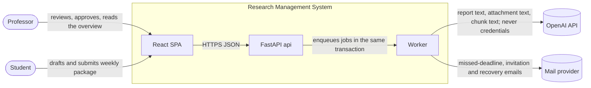
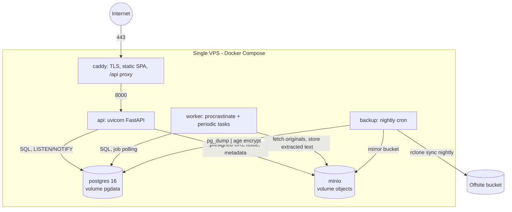
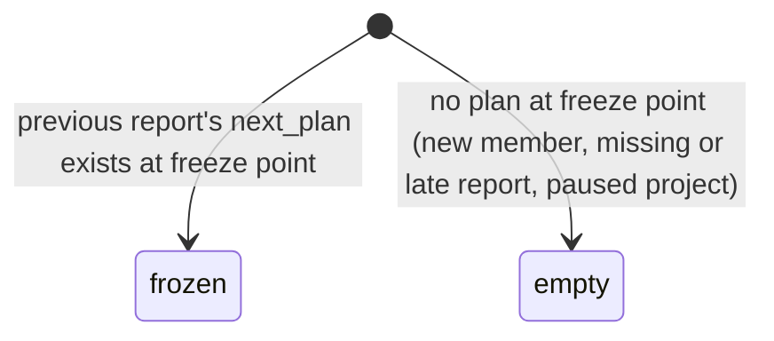
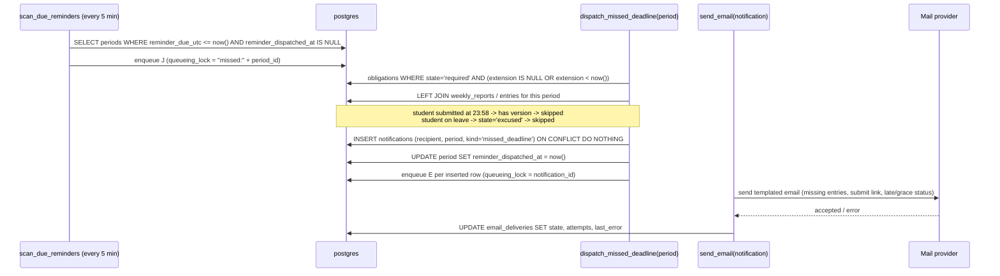
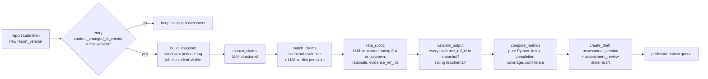

# Research Management System — Architecture

Version 0.11 — 8 October 2026 — implements [research_management_requirements.md](research_management_requirements.md) v0.14

This document turns the logical boundaries in section 10 of the requirements into a concrete design. Each section names the requirement IDs it satisfies; section 16 maps every ID in the specification to the section that covers it.

## 1 Purpose, scope, and fixed decisions

| Decision | Choice | One-line reason |
| --- | --- | --- |
| Backend | Python 3.12, FastAPI, SQLAlchemy 2, Alembic, Pydantic v2 | Matches the team's existing FastAPI projects |
| Frontend | React 18, Vite, TypeScript, TanStack Query, shadcn/ui | Same toolchain as the graph-digitizer frontend |
| Database | PostgreSQL 16 (stock `postgres:16-bookworm`), no extension beyond `pg_trgm` | One store for records, the evidence index, and the job queue |
| Jobs | procrastinate (Postgres-backed queue) running periodic tasks in the worker | Transactional enqueue; no Redis to operate |
| Files | MinIO (S3 API) on the same host | Presigned uploads, versioned bucket, easy offsite mirror |
| LLM | OpenAI GPT API (structured completions for the assessment) behind one internal gateway module | Vendor isolated to one module; swappable |
| Hosting | Single VPS, Docker Compose, Caddy for TLS | 50 students and 30 projects fit one host with headroom |

Out of scope for this document: UI visual design, exact prompt texts, and institutional SSO (deferred per section 12 of the requirements).

## 2 System context


```mermaid
flowchart LR
    Prof([Professor])
    Stu([Student])
    subgraph RMS[Research Management System]
        SPA[React SPA]
        API[FastAPI api]
        WRK[Worker]
    end
    OAI[(OpenAI API)]
    MAIL[(Mail provider)]

    Prof -- "reviews, approves, reads the overview" --> SPA
    Stu -- "drafts and submits weekly package" --> SPA
    SPA -- "HTTPS JSON" --> API
    API -- "enqueues jobs in the same transaction" --> WRK
    WRK -- "report text, attachment text, chunk text; never credentials" --> OAI
    WRK -- "missed-deadline, invitation and recovery emails" --> MAIL
```

What crosses the boundaries matters for the AI data boundary (requirements section 11): only the worker talks to OpenAI, and only with content the gateway has assembled from the permission-labelled snapshot. Credentials and other students' private reports never leave the host.

## 3 Deployment view


```mermaid
flowchart TB
    subgraph VPS[Single VPS - Docker Compose]
        CADDY[caddy: TLS, static SPA, /api proxy]
        API[api: uvicorn FastAPI]
        WRK[worker: procrastinate + periodic tasks]
        PG[(postgres 16\nvolume pgdata)]
        MINIO[(minio\nvolume objects)]
        BK[backup: nightly cron]
    end
    OFF[(Offsite bucket)]
    NET((Internet))

    NET -- "443" --> CADDY
    CADDY -- "8000" --> API
    API -- "SQL, LISTEN/NOTIFY" --> PG
    WRK -- "SQL, job polling" --> PG
    API -- "presigned URL issue, metadata" --> MINIO
    WRK -- "fetch originals, store extracted text" --> MINIO
    BK -- "pg_dump | age encrypt" --> PG
    BK -- "mirror bucket" --> MINIO
    BK -- "rclone sync nightly" --> OFF
```

Service notes:

- **caddy** terminates TLS with automatic certificates, serves the built SPA, and proxies `/api/*` to `api`. No CORS because the SPA and API share an origin.
- **api** and **worker** run the same image with different commands. The worker also runs the periodic tasks (section 12), so there is no separate scheduler container.
- **postgres** uses the stock `postgres:16-bookworm` image (ADR 0024). One volume. `shared_buffers` and `work_mem` tuned for the host; the queue and the records share the instance.
- **minio** holds one versioned bucket per environment. The API never streams file bodies; it issues presigned PUT and GET URLs after an authorization check.
- **backup** runs nightly `pg_dump -Fc`, encrypts with `age`, mirrors the MinIO bucket, and syncs both to an offsite bucket with `rclone`. Retention 30 daily and 12 monthly. A restore drill against a scratch Compose stack is part of the launch checklist (AC-16).
- Health: `/api/healthz` (process up), `/api/readyz` (database, object store, worker heartbeat, SMTP relay). Compose `restart: unless-stopped`.
- Secrets live in a root-owned `.env` file with mode 600 and are injected as environment variables. Provider credentials (OpenAI key, SMTP password) are referenced by name in application records and never stored in the database (requirements section 9).

## 4 Code layout

### 4.1 Backend: modular monolith

```
backend/
  app/
    core/           config, db session, migrations hook, authz (Scope, visible_to), audit, jobs (procrastinate app), clock
    identity/       users, invitations, sessions, break-glass CLI
    projects/       projects, memberships, plan_baselines
    reporting/      reporting_periods, obligations, weekly_reports, report_versions, entries, artifacts
    evidence/       evidence_references, evidence_chunks, index/ (chunking)
    assessment/     rubrics, snapshot.py, pipeline/ (claims, matching, rating), metrics.py, versions, review
    overview/       service.py: the professor overview's numbers (next deadline, missing reports, week
                    board, review queue, stalled runs)
    notifications/  notification records, email/{base,smtp,console}.py, templates, scheduler_tasks.py
    ai/             gateway.py, prompts/ (registry with versions), schemas/ (structured outputs), cost.py, redaction.py
    api/            one router per module, dependency wiring
  tests/
  alembic/
```

Dependency rule, enforced by an import-linter contract in CI:

```
core → identity → projects → reporting → evidence → assessment → overview
notifications → reporting          (and core; never evidence, assessment or overview)
ai ← assessment                    (no other module may import ai)
```

A module reads another module's data only through that module's `service.py`; it never imports another module's ORM tables into its own queries. This keeps the authorization filter (section 6) in one place per aggregate.

### 4.2 Frontend routes

| Route | Screen | Requirement |
| --- | --- | --- |
| `/overview` | Professor overview: next deadline, the week's reports by project and student, outstanding reports with an as-of time, review queue, stalled analyses with retry, budget and mail warnings | UI-01 |
| `/me` | Student overview: this week's obligations, draft or submitted state, deadline, earlier weeks with each one's report state | UI-02 |
| `/me/profile`, `/me/assessments/:id` | The student's own trajectory and released assessments | UI-02, UI-04 |
| `/projects` | Project list for both roles; create; for a student, projects open to joining | PROJ-01, PROJ-07 |
| `/projects/:id` | Project workspace: research questions, members, related documents, the repository link; stage and standing controls for the professor, record editing for the creator | UI-03 |
| `/reports` | Both roles: the workspace's for a professor, a student's own for a student (the API scopes it; the student's view drops names, the student filter and needs review, and links to their own reader and assessments). Every submitted weekly report, by week, newest first, filtered by week, student, project, state and needs review (in the URL); late flag, versions, state, assessment links. Drafts are never listed (`GET /api/v1/reports`) | UI-01, REP-05 |
| `/students/:id` | Student research profile (professor), with each recent week's report state | UI-04 |
| `/students/:studentId/reports/:periodId` | One submitted week, read back: every version, every entry including projects since left; mark reviewed, request a revision | REP-02, REP-05, UI-04 |
| `/people` | The roll of the workspace being worked in: invite, resend, move, suspend, restore, remove | AUTH-01, AUTH-06, UI-08 |
| `/workspaces` | The workspace being worked in — rename (owner only) and its weekly schedule, whose save opens the weeks and derives this week's obligations — then the others belonged to or owned: join, leave, archive; create. Switching is the header's own control on every screen | UI-08, AUTH-04, AUTH-05, REP-01 |
| `/review/:assessmentId` | Review workspace: claims and discrepancies, evidence snapshot, draft ratings; approve, or override with a rationale | UI-05 |
| `/report/:periodId` | One weekly submission flow with a tab per required project entry | REP-02, REP-03 |
| `/report/:periodId/submitted` | What the student actually submitted, as against the draft the editor shows | REP-02, REP-05 |
| `/login`, `/accept-invitation`, `/reset-password` | Sign in (and request a reset); set a password from an invitation or recovery link; public | AUTH-01 |
| `/status` | Readiness of database, object store, worker and mail relay; public | — |

## 5 Data architecture

### 5.1 Table groups

| Group | Tables |
| --- | --- |
| Identity | `workspaces`, `workspace_members`, `users`, `invitations`, `sessions`, `password_resets`, `audit_events` |
| Projects | `projects`, `project_memberships`, `plan_baselines`, `plan_baseline_items` |
| Reporting | `calendar_configs`, `reporting_periods`, `reporting_obligations`, `weekly_reports`, `report_versions`, `project_report_entries`, `revision_requests`, `artifacts`, `artifact_versions` |
| Evidence | `evidence_references`, `evidence_chunks` |
| Assessment | `rubric_versions`, `evidence_snapshots`, `evidence_snapshot_items`, `analysis_runs`, `assessment_versions`, `assessment_reviews` |
| Operations | `notifications`, `email_deliveries`, `ai_calls`, `procrastinate_*` (queue, managed by the library) |

Every table carries `workspace_id`; composite foreign keys `(workspace_id, x_id)` enforce the same-workspace invariant from requirements section 9.

`workspace_members` records which workspaces an account belongs to, which is plural for a professor; `users.workspace_id` records the one it is *working in*. The first is which workspaces a professor may switch into; the second is where both reads and writes go. `Scope` names that one `workspace_id`, and every visibility predicate is built on `Scope.within` (ADR 0015, ADR 0020, ADR 0021). Archiving and the roll read the first; every per-user row is anchored to the second.

Six of those point at `users(workspace_id, id)`, split in two by ADR 0014. The four holding identity records — `invitations`, `sessions`, `password_resets`, `notifications` — carry `ON UPDATE CASCADE` and follow the account when it joins another workspace. The two holding research history — `project_memberships`, `weekly_reports` — do not, so Postgres refuses to move an account that has written anything. That split is what makes "history stays in the workspace it was written in" a property of the schema, and why moving a student is only half-built: `POST /api/v1/users/{user_id}/workspace` moves an account that has written nothing, and the database refuses one that has (AUTH-06); see use_cases.md §2.1.

### 5.2 Central tables

Types abbreviated. `id` columns are UUIDv7 unless noted. All timestamps are `timestamptz` in UTC.

**users** — `id, workspace_id, role ENUM(prof, student), email UNIQUE, display_name, password_hash, state ENUM(invited, active, deactivated), deactivated_at, created_at`

**project_memberships** — `id, workspace_id, project_id, student_id, responsibility, joined_on DATE, left_on DATE NULL, first_required_period_id NULL, last_required_period_id NULL, planned_allocation NUMERIC NULL, created_at`
Constraint `uq_membership_active`: unique `(project_id, student_id)` where `left_on IS NULL`. `left_on` is exclusive — the first day the student is no longer a member — so ending a membership today revokes access today (AUTH-03), and a departure dated in the future keeps access until it arrives.

**calendar_configs** — `id, workspace_id, version INT, timezone TEXT, meeting_weekday SMALLINT, week_start_weekday SMALLINT, grace_minutes INT, effective_from DATE, created_by, created_at`
The deadline is not stored here; it is derived per period (section 7).

**reporting_periods** — `id, workspace_id, calendar_config_id, local_start DATE, local_end DATE, start_utc, end_utc, meeting_date DATE, deadline_utc, reminder_due_utc, reminder_dispatched_at NULL`
Constraint `uq_period_start`: unique `(workspace_id, local_start)`. `deadline_utc` is 23:59:00 local on `meeting_date - 1 day`. `reminder_due_utc = deadline_utc + interval '60 seconds'`.

**reporting_obligations** — `id, workspace_id, membership_id, period_id, state ENUM(required, excused), excuse_reason, extension_until_utc NULL, created_at`
Constraint `uq_obligation`: unique `(membership_id, period_id)`.

**weekly_reports** — `id, workspace_id, student_id, period_id, workflow_state ENUM(draft, submitted, revision_requested, resubmitted, reviewed), first_submitted_at NULL, current_version_id NULL, draft_content JSONB, draft_saved_at`
Constraint `uq_report`: unique `(student_id, period_id)`. `first_submitted_at` is written once and never updated (REP-07, AC-13); the `freeze_first_submitted_at` trigger raises on any change after it is set.

**report_versions** — `id, workspace_id, report_id, version_no INT, author_id, submitted_at, idempotency_key TEXT, timing_status ENUM(on_time, late, excused)`
Constraints `uq_report_version (report_id, version_no)`, `uq_report_idem (report_id, idempotency_key)`. Immutable (section 5.3).

**project_report_entries** — `id, workspace_id, report_version_id, project_id, stage, planned_work_ref, work_performed TEXT, results TEXT, experiments JSONB, deviations TEXT, next_plan JSONB, questions TEXT, evidence_refs JSONB, hours NUMERIC NULL, content_hash BYTEA, content_changed_in_version_id`
Constraint `uq_entry (report_version_id, project_id)`. `content_hash` is SHA-256 over the canonical JSON of the entry fields excluding `hours`. On resubmission, if the hash equals the previous version's entry, `content_changed_in_version_id` is copied forward; otherwise it is set to the new version. Immutable.

**plan_baselines** — `id, workspace_id, membership_id, period_id, version_no INT, state ENUM(frozen, empty, proposed, accepted, superseded), frozen_at, source_entry_id NULL, change_reason TEXT NULL, proposed_by NULL, approved_by NULL, approved_at NULL`
Constraint `uq_baseline_in_effect`: unique `(membership_id, period_id)` where `state IN ('frozen','accepted')`. Rows are immutable. `plan_baseline_items` holds `(baseline_id, planned_outcome, weight NUMERIC, acceptance_criteria)` — lines of the student's next-week plan — and an unused `task_id` with no foreign key. Only `frozen` and `empty` are written; `proposed`, `accepted` and `superseded` remain in the enum for historical rows.

**evidence_references** — `id, workspace_id, project_id, owner_student_id NULL, visibility ENUM(professor_only, student_private, project_shared), source_kind ENUM(report_entry, artifact_version, repository_event, decision, feedback), source_id, source_version TEXT, locator TEXT, supported_claim TEXT NULL, source_time, ingested_at`
Every indexed piece of evidence has exactly one row here, and `evidence_chunks` rows reference it. Visibility is copied from the source at ingestion and re-synced when the source changes. Only `report_entry` and `artifact_version` are written; the other three labels name sources that are gone and stay in the enum because it has rows under it.

**evidence_snapshots** — `id, workspace_id, student_id, project_id, period_id, window_start_utc, window_end_utc, integration_lag_days INT, built_at, item_count INT, coverage_notes JSONB`
`evidence_snapshot_items` — `(snapshot_id, evidence_ref_id, source_version)`, primary key on both. Built only from `evidence_references` with `visibility <> 'professor_only'` and whose student-visible test passes for `student_id` (ASSESS-01).

**assessment_versions** — `id, workspace_id, student_id, project_id, period_id, version_no INT, report_version_id, entry_id, baseline_id NULL, snapshot_id, rubric_version_id, ratings JSONB, progress_index SMALLINT NULL, plan_completion NUMERIC NULL, coverage_pct NUMERIC, confidence ENUM(high, medium, low), confidence_reasons JSONB, narrative JSONB, model_name, prompt_versions JSONB, analysis_run_id, created_at`
Constraint `uq_assessment_version (student_id, project_id, period_id, version_no)`. Immutable. `ratings` stores per-dimension `{rating: 0-4|"unknown"|"not_applicable", rationale, evidence_ref_ids[]}`.

**assessment_reviews** — `id, workspace_id, assessment_version_id, state ENUM(draft, approved, superseded, withdrawn), reviewer_id, override JSONB NULL, rationale TEXT NULL, published_at NULL, created_at`
Constraint `uq_one_approved`: unique `(assessment_version_id)` where `state = 'approved'`. Students read only versions with an `approved` review.

### 5.3 Immutability and audit

Tables `report_versions`, `project_report_entries`, `plan_baselines`, `plan_baseline_items`, `evidence_snapshot_items`, `assessment_versions`, `audit_events` get:

```sql
CREATE TRIGGER trg_immutable BEFORE UPDATE OR DELETE ON report_versions
  FOR EACH ROW EXECUTE FUNCTION raise_immutable();
```

The application layer also exposes no update path for these tables. Retention-driven deletion (section 15) runs as a privileged migration-style job that disables the trigger inside a single transaction and records an `audit_events` row.

`audit_events` — `id, workspace_id, actor_id NULL, actor_kind ENUM(user, system, job), action TEXT, target_table, target_id, before JSONB NULL, after JSONB NULL, request_id, occurred_at`. Every mutation goes through a service method that writes the audit row in the same transaction.

### 5.4 Invariants as constraints

| Requirement invariant | Constraint |
| --- | --- |
| Unique report per student–period | `uq_report` |
| Unique entry per report version–project | `uq_entry` |
| Unique obligation per membership–period | `uq_obligation` |
| One baseline in effect per membership–period | `uq_baseline_in_effect` |
| Immutable submitted and approved versions | `trg_immutable` triggers; `uq_one_approved` |
| Same-workspace foreign keys | Composite FKs including `workspace_id` |
| Explicit access labels on indexed evidence | `evidence_chunks.visibility NOT NULL`, FK to `evidence_references` |

### 5.5 Plan baseline lifecycle (PROJ-04, ASSESS-05)


```mermaid
stateDiagram-v2
    [*] --> frozen: previous report's next_plan exists at freeze point
    [*] --> empty: no plan at freeze point (new member, missing or late report, paused project)
```

The freeze point is `reporting_periods.start_utc` by default. A periodic task `freeze_baselines(period_id)` runs at period start and inserts a `frozen` or `empty` row per required obligation; it is idempotent, so a membership that already has a baseline for the period keeps it. Baseline rows carry their own database guard rather than the blanket immutability trigger: the content columns can never change. Commitment completion (ASSESS-05) is computed only against a row in state `frozen` (or a historical `accepted` one); otherwise — an `empty` week — the assessment shows completion as unavailable. The first-plan proposal, its acceptance and versioned changes were withdrawn in requirements 0.10: they had no route and no screen.

### 5.6 File storage

Bucket layout: `{workspace_id}/artifacts/{artifact_id}/{version_no}/{sha256}.{ext}` for originals and `.../extracted.txt` for text. `artifact_versions` stores `sha256, byte_size, content_type, storage_key, extraction_state ENUM(pending, ok, failed, unsupported), extracted_text_key`. Upload flow: the API validates size against the configured per-file limit (25 MB default) and per-entry total, issues a presigned PUT, and on completion the worker verifies the checksum, runs extraction (PDF, DOCX, Markdown, images stored as-is), and enqueues indexing. A file attached to a project and to no reporting period is a project document rather than a week's evidence: same table, same bucket, read by everyone on the project, and **not** extracted or indexed, so its version stays `pending` and nothing can cite it ([ADR 0018](adr/0018-project-documents-are-shared-with-the-project.md)). There is no link fetching: REP-04 made evidence a file, the endpoint and the worker's fetch path went with it, and no code in the backend resolves a URL. `artifacts.source_url` and `ArtifactKind.LINK` remain as historical values on rows filed before that, which the reader still shows and nothing re-reads.

### 5.7 Evidence index storage

`evidence_chunks` — `id, workspace_id, evidence_ref_id, project_id, owner_student_id NULL, visibility, source_version, chunk_no, text, source_time`. Report entries are indexed on `ReportSubmitted`, attachments on `ArtifactExtracted`, and an attachment's chunks are dropped on `ArtifactRemoved`. Each chunk carries the access label of its source and resolves to a citation `(source_kind, source_id, source_version, locator)` through `evidence_references`. Two reads remain, both used by the assessment snapshot builder (9.2): the window read (`search_evidence_window`, a project's chunks within a time range) and the by-source read (`evidence_for_sources`, a week's own report entries by identity); both apply the `EvidenceChunk` visibility policy before returning anything. Index: B-tree on `(workspace_id, project_id, visibility, source_time)`.

There is no search over the index, no embedding and no full-text column: indexing is chunking alone and calls no model provider ([ADR 0023](adr/0023-no-research-assistant.md), [ADR 0024](adr/0024-no-embeddings.md)).

## 6 Authorization and confidentiality

### 6.1 Scope and filters

Each request resolves a `Scope`:

```python
@dataclass(frozen=True, slots=True)
class Scope:
    workspace_id: UUID                        # where a write goes and what a read sees
    user_id: UUID
    role: Literal["prof", "student"]
    project_ids: frozenset[UUID]              # active memberships for a student; empty for a prof,
                                              # whose predicates branch on the role instead
    is_system: bool                           # a job borrowing an identity, not an author
```

`Scope.within(column)` is the workspace half of every visibility predicate — `column = workspace_id`
— and the only place the read-set is compared, so changing what a read may see is one diff rather
than thirty-three. A professor belongs to as many workspaces as they have joined, but sees the one
the header switcher names; switching changes what every screen shows (ADR 0020, ADR 0021). The
invariant that keeps workspaces apart from each other's records is not in this Scope at all — it is
the composite foreign keys, which refuse a membership, report or assessment whose workspace does not
match both the project and the account it names.

Every repository function accepts `scope` and applies `visible_to(scope, Model)`, a SQLAlchemy predicate builder with one implementation per aggregate:

| Aggregate | Professor | Student |
| --- | --- | --- |
| Weekly report, entry | All in workspace | `student_id = scope.user_id` |
| Artifact — a week's evidence | All in workspace | `owner_student_id = scope.user_id` |
| Artifact — a project document (no period, no entry) | All in workspace | `project_id IN scope.project_ids` ([ADR 0018](adr/0018-project-documents-are-shared-with-the-project.md)) |
| Assessment version | All | Own, and only where an `approved` review exists |
| Project | All | `project_id IN scope.project_ids` |
| Evidence chunk | All in workspace | `visibility = 'project_shared' AND project_id IN scope.project_ids` OR `owner_student_id = scope.user_id` |

Downloads reuse the same predicates: a presigned GET is issued only after `visible_to` selects the artifact version (AC-02). The evidence reads an assessment snapshot is built from — the window and by-source reads in `app/evidence/repository.py` — apply `visible_to(scope, EvidenceChunk)`, registered in `app/evidence/policies.py`, so there is no second permission model (AUTH-02).

### 6.2 Authentication and account lifecycle (AUTH-01)

- Invitation: a professor creates a user in state `invited`; a signed, single-use token with 7-day expiry is emailed. Accepting sets the password and activates. Any professor may invite a colleague at role `prof`; that is the only way a professor is added short of bootstrap or break-glass (ADR 0011).
- Roles: fixed at acceptance. Before acceptance a re-invitation may reissue at a different role — the role travels on the user row; after acceptance only break-glass moves it, so there is no `set_role` and no route to change one.
- Removal: `POST /users/{id}/remove` ends every open project membership and deactivates the account in one transaction. identity emits `UserRemoved`; projects subscribes and closes the memberships, which is what stops the derived weekly obligations. Deactivation alone is suspension and leaves memberships open. A professor account is refused — that is break-glass.
- Sessions: server-side rows in `sessions` with an opaque cookie (`HttpOnly`, `Secure`, `SameSite=Lax`), 12-hour idle expiry, 30-day absolute. Deactivating a user deletes their sessions in the same transaction (AUTH-03).
- Recovery: password reset by emailed single-use token for every user, requested from the sign-in screen.
- Token emails: notifications subscribes to `InvitationCreated` and `PasswordResetRequested` and defers a `notifications.send_token_email` job, which is sent only after the issuing transaction commits. They bypass `email_deliveries` because a token message has no in-app counterpart — the addressee has no session — and the queue row would hold a live credential until the next sweep.
- Break-glass: `python -m app.cli breakglass recover-professor --email …` (also reachable as `python -m app.identity.breakglass`) runs only with shell access on the host, requires the `.env` secret, writes an `audit_events` row with `actor_kind = system`, and emails the previous professor address. It issues a single-use recovery link valid for 15 minutes rather than a password, so the secret is handed over out of band. `transfer-professor --from … --to …` deactivates the outgoing account in the same transaction and moves `workspaces.owner_id`, the workspace's break-glass contact. `demote-professor` and `deactivate-professor` eject a co-supervisor; every command that could reduce the professor count refuses to leave a workspace with none. None of this is reachable through the API (ADR 0011).

### 6.3 Access changes (AUTH-03, AC-11)

Ending a membership revokes access at once because nothing caches a read: every request compiles `Scope.project_ids` from the memberships table, and every read applies `visible_to` against it. Deactivating a user deletes their sessions in the same transaction (6.2). Snapshots are historical records and are not invalidated.

### 6.4 Confidentiality of professor material (QA-06)

Withdrawn with QA-06 ([ADR 0023](adr/0023-no-research-assistant.md)). What remains is that an assessment's snapshot is built through the student's own view and never from `professor_only` evidence (5.2, 9.2; ASSESS-01).

### 6.5 Workspaces and the tenant boundary (AUTH-04, AUTH-05, AUTH-06, UI-08)

A workspace is the tenant boundary, and two different relations describe an account's connection to one.

- **Ownership** — `workspaces.owner_id` — is the administration relation (ADR 0012). It decides what a professor may create, rename and archive.
- **Belonging** — a `workspace_members` row — is what a professor may work in, and it is plural (ADR 0015). `users.workspace_id` keeps its other job: naming the workspace a `Scope` is compiled from, and anchoring every composite foreign key in the schema.

The two differ in practice, which is why neither alone is the right gate. A professor invited as a colleague belongs to a workspace they do not own; one who created a workspace and later left owns one they do not belong to. `GET /workspaces` returns the union, and entering or reading one is gated on that union, while renaming and archiving stay with ownership.

Reads and writes both follow the workspace being worked in (ADR 0020): `Scope.workspace_id` is where a write goes and the only workspace a read sees, compared in `Scope.within(column)` (ADR 0021). Archiving counts memberships rather than the column, the roll is keyed by membership, and leaving an account's only membership is refused because `users.workspace_id` is not nullable.

Moving a student between workspaces is decided by the schema, not by a check: section 5.1's four-and-four foreign-key split refuses any account that has written history (AUTH-06).

## 7 Reporting calendar and scheduling

### 7.1 Period generation (REP-01)

A periodic task `ensure_periods()` runs daily and materialises `reporting_periods` eight weeks ahead using the `calendar_configs` row whose `effective_from` is the latest not after the period's `local_start`. For each period:

```
local_start   = first week_start_weekday on or after previous local_end + 1
local_end     = local_start + 6 days
meeting_date  = first meeting_weekday on or after local_end + 1 day
deadline_utc  = to_utc(meeting_date - 1 day, 23:59:00, timezone)
reminder_due_utc = deadline_utc + 60 s
```

The meeting follows the week it discusses, so the deadline falls inside the period: with the
proposed default the week of Mon 14 to Sun 20 September is discussed on Mon 21 and is due Sun 20 at
23:59 local. Deriving `meeting_date` from `local_start` instead would put the deadline on the day
before the period opens.

Changing the meeting day inserts a new `calendar_configs` version with an `effective_from`; periods already materialised keep their `deadline_utc` (requirements REP-01). Obligations are derived per period from memberships whose `joined_on ≤ local_end`, `left_on` is null or `≥ local_start`, the project is `active`, and `first/last_required_period_id` bounds are satisfied; exemptions and extensions edit the obligation row, never the period. The same two tests — the membership open through the week, the project still `active` — are applied again when an already-derived obligation is read, so taking a project out of `active` takes the week off everyone on it without touching a row ([ADR 0019](adr/0019-ending-a-membership-is-the-professors.md)).

### 7.2 Missed-deadline email (REP-08, AC-19)


```mermaid
sequenceDiagram
    participant W as scan_due_reminders (every 5 min)
    participant DB as postgres
    participant J as dispatch_missed_deadline(period)
    participant E as send_email(notification)
    participant M as Mail provider

    W->>DB: SELECT periods WHERE reminder_due_utc <= now() AND reminder_dispatched_at IS NULL
    W->>DB: enqueue J (queueing_lock = "missed:" + period_id)
    J->>DB: obligations WHERE state='required' AND (extension IS NULL OR extension < now())
    J->>DB: LEFT JOIN weekly_reports / entries for this period
    Note over J,DB: student submitted at 23:58 -> has version -> skipped<br/>student on leave -> state='excused' -> skipped
    J->>DB: INSERT notifications (recipient, period, kind='missed_deadline') ON CONFLICT DO NOTHING
    J->>DB: UPDATE period SET reminder_dispatched_at = now()
    J->>DB: enqueue E per inserted row (queueing_lock = notification_id)
    E->>M: send templated email (missing entries, submit link, late/grace status)
    M-->>E: accepted / error
    E->>DB: UPDATE email_deliveries SET state, attempts, last_error
```

Obligation state is read inside `J`, so a submission at 23:59:30 is seen before any email is created. The professor sees the unfulfilled obligation on the overview's outstanding list, derived from the obligations themselves. The `ON CONFLICT DO NOTHING` on `uq_notification (recipient_id, period_id, kind)` and the queueing lock make a retried job a no-op (AC-19). An entry missing for one of two required projects yields one email listing the missing project. Delivery is a queued row rather than one job per message: `dispatch_missed_deadline` writes an
`email_deliveries` row in state `queued` in the same transaction as the notification, and a periodic
`send_queued_emails` task drains them. That keeps the attempt count and the last error in one place
and gives the same at-least-once behaviour, since both the notification and its delivery row are
keyed. A send is attempted five times; after that the notification row remains with
`state = failed` and the professor overview shows a mail-delivery warning.

### 7.3 Pre-deadline reminders (REP-07)

Withdrawn in requirements 0.10 (migration 0027). The missed-deadline email in 7.2 is the one reminder.

## 8 Repository evidence

Withdrawn with REPO-01..08 ([ADR 0022](adr/0022-no-repository-connector.md)). A project's repository is `projects.repo_url`, a link nothing reads (PROJ-01); work a student wants assessed is attached to the report (REP-04) and indexed like any attachment (5.7). The section number is kept so references stay valid.

## 9 Assessment pipeline

### 9.1 Job DAG


```mermaid
flowchart LR
    S[report submitted\nnew report_version] --> T{entry content_changed_in_version\n= this version?}
    T -- no --> K[keep existing assessment]
    T -- yes --> B[build_snapshot\nwindow = period ± lag\nlabels student-visible]
    B --> C[extract_claims\nLLM structured]
    C --> M[match_claims\nsnapshot evidence\n+ LLM verdict per claim]
    M --> R[rate_rubric\nLLM structured: rating 0-4 or unknown,\nrationale, evidence_ref_ids]
    R --> V[validate_output\nevery evidence_ref_id in snapshot?\nrating in schema?]
    V --> X[compute_metrics\npure Python: index, completion,\ncoverage, confidence]
    X --> D[create_draft assessment_version\n+ assessment_review state=draft]
    D --> N[professor review queue]
```

Each step is a procrastinate job keyed `assess:{student}:{project}:{period}:{report_version}:{step}`; a rerun of the same key is a no-op unless the previous attempt failed. `analysis_runs` records inputs (`report_version_id, snapshot_id, rubric_version_id, prompt_versions`) and per-step status, giving the job states queued/running/completed/partial/failed required by section 10 of the requirements. A failed LLM step leaves the run `partial`; the review queue shows the entry as "assessment pending, model step failed, retry available" and the report remains submitted with its original timestamp (AC-13).

### 9.2 Snapshot window

`window_start_utc = period.start_utc`, `window_end_utc = period.end_utc`. Items: the entry's own evidence references, found by identity so a late report stays in its own week, artifact versions in the project within the window that the student may see, and the frozen baseline. Coverage notes record what was omitted, such as extraction failures (ASSESS-06). `evidence_snapshots.integration_lag_days` and `evidence_snapshot_items.integration_of_earlier_work` remain for historical rows and are always 0 and false.

### 9.3 Structured rubric output

The model must return JSON matching this schema (the gateway enforces it with structured outputs and rejects anything else):

```json
{
  "dimensions": [
    {"dimension_id": "progress", "rating": "0|1|2|3|4|unknown", "rationale": "string", "evidence_ref_ids": ["uuid"]},
    {"dimension_id": "learning", "rating": "...", "rationale": "...", "evidence_ref_ids": []},
    {"dimension_id": "rigor", "rating": "...", "rationale": "...", "evidence_ref_ids": []},
    {"dimension_id": "artifacts", "rating": "...", "rationale": "...", "evidence_ref_ids": []}
  ],
  "plan_items": [{"item_id": "uuid", "proposed_completion": 0.0, "reason": "string", "evidence_ref_ids": []}],
  "accomplishments": ["string"],
  "blockers": ["string"],
  "discrepancies": [{"claim": "string", "status": "supported|partially_supported|unsupported|unverifiable", "evidence_ref_ids": []}],
  "limitations": ["string"],
  "next_steps": ["string"],
  "discussion_agenda": ["string"]
}
```

**`dimensions` is a list, not a map keyed by dimension**, because the provider's strict structured
outputs cannot express an object whose keys are not known in advance, and the rubric's dimensions
are configured at runtime. `validate_output` turns the list back into the map keyed by dimension
that `assessment_versions.ratings` stores.

Nothing in these schemas may carry a JSON Schema keyword strict mode rejects — numeric bounds
among them, which is why `proposed_completion` is validated in Python rather than constrained on
the wire. `ai/schemas/strict.py` reimplements the provider's rules (the SDK's own converter accepts schemas
the server rejects) and a unit test asserts every response model against them; `FakeGateway`
applies the same check, so a schema the provider would refuse fails the ordinary suite.

`not_applicable` is never a model output; it comes only from `rubric_versions.stage_applicability` (ASSESS-04). `validate_output` drops any `evidence_ref_id` not present in the snapshot and downgrades the affected rating to `unknown` with a recorded reason, so a fabricated citation cannot survive (AC-07, AC-12). It also drops a `dimension_id` the rubric does not have and takes first-wins on a repeat — both recorded — because a list admits what a map could not.

### 9.4 Deterministic metrics (`assessment/metrics.py`)

```python
def progress_index(ratings: dict[str, int | None], weights: dict[str, Decimal]) -> int | None:
    applicable = {d: w for d, w in weights.items() if ratings.get(d) is not None}
    if len(applicable) < len(weights_applicable_by_rubric): return None   # any applicable dimension unknown -> Not rated
    total = sum(w * Decimal(ratings[d]) / 4 for d, w in applicable.items()) / sum(applicable.values())
    return int((total * 100).quantize(Decimal("1"), rounding=ROUND_HALF_UP))

def plan_completion(items: list[PlanItem]) -> Decimal | None:   # frozen weights, accepted fractions in [0,1]
def coverage_pct(sufficiency: dict[str, bool], weights) -> Decimal
def confidence(coverage: Decimal, source_status: SourceStatus) -> tuple[Level, list[str]]  # rule table, reasons listed
```

Unit test fixed by the specification: ratings 3, 4, 3, 2 with weights 30, 30, 25, 15 give 78.75 and display 79 (ASSESS-04). Confidence rules are a small table (for example: coverage ≥ 90 % → high; any `unverifiable` discrepancy on a rated dimension → at most medium; missing report or missing baseline → low with the reason named), stored in `rubric_versions.calculation_rules` so a change is versioned (ASSESS-06, ASSESS-09). A project with no code is not a gap in coverage: a literature or theory project reaches full coverage through its report and other artifacts (AC-05).

### 9.5 Versioning triggers (ASSESS-08, ASSESS-09, AC-03, AC-17)

| Event | Effect |
| --- | --- |
| New report version, entry content changed | New assessment version for that entry only |
| New report version, entry unchanged | None; existing assessment keeps pointing at `content_changed_in_version_id` |
| New evidence arrives after approval (a late attachment) | New draft version flagged `evidence_update`; the approved version stays published until the professor approves the new one |
| Rubric or model version change | No automatic rerun; the professor may request recalculation, producing a new version labelled with the new rubric |
| Professor override | `assessment_reviews.override` on the same version with rationale; original model output stays in `assessment_versions` |

Trends (ASSESS-10) are queries over `assessment_versions` joined to `assessment_reviews.state = 'approved'`, grouped by rubric version, so a rubric change appears as a labelled break rather than a comparable series. `progress_series` in `backend/app/assessment/service.py` (served by `GET /api/v1/trends`) carries the rubric version of every point, and `frontend/src/features/assessments/components/Trajectory.tsx` marks the break (AC-10).

## 10 AI gateway

`ai/gateway.py` is the only module that imports the OpenAI SDK.

```python
class AIGateway:
    async def complete_structured(self, *, prompt_id: str, inputs: dict, schema: type[BaseModel],
                                  budget: Budget, context: CallContext) -> Result[BaseModel]: ...
```

Responsibilities:

- **Prompt registry.** `ai/prompts/{prompt_id}/v{n}.md` with a manifest of model, temperature 0, schema, and max tokens. Three prompts, all the assessment's: `extract_claims`, `match_claims`, `rate_rubric`. `CallContext` records `(prompt_id, prompt_version, model)` into `assessment_versions.prompt_versions` and `analysis_runs` (ASSESS-09).
- **Untrusted content framing.** Every retrieved text is inserted inside a delimited data block with a system instruction that the block is evidence to analyse, not instructions to follow, and that no tool or action is available. The gateway exposes no function-calling tools to the model at all; actions exist only as product endpoints (AC-12).
- **Redaction.** Before sending, `redaction.py` strips strings matching credential patterns (tokens, keys, connection strings) and replaces emails other than the subject student's with placeholders. Credentials never reach the gateway anyway because they are not stored in the database.
- **Cost ledger.** `ai_calls` — `(id, job_id, project_id, prompt_id, prompt_version, model, tokens_in, tokens_out, cost_usd, latency_ms, status, created_at)`. Budgets per project and per month live in `workspaces.ai_budgets`; when exceeded, the job records `delayed_budget` and the review queue shows "analysis delayed: budget" rather than a silent failure.
- **Caching.** Claim extraction is keyed by `content_hash` of the entry, so an unchanged entry is never re-extracted.
- **Restriction flag.** `projects.ai_restricted = true` short-circuits every model step of the assessment (indexing calls no provider for any project): the pipeline still builds the snapshot and metrics for the plan, produces a qualitative draft with `Not rated — restricted`, and the professor rates manually.
- **Timeouts and partial state.** 60 s per call, two retries on transient errors, then the step fails and the run is `partial`. Logs carry ids, token counts, and status; never prompt or completion text.

## 11 Professor overview

The professor research assistant this section once described is withdrawn with QA-01..07 ([ADR 0023](adr/0023-no-research-assistant.md)). The overview's numbers are plain functions in `backend/app/overview/service.py` — `next_deadline`, `missing_reports`, `week_reports`, `review_queue`, `stalled_analyses` — each a query through the owning module's service under the caller's `Scope`. `GET /api/v1/overview` (`backend/app/api/v1/overview.py`) calls them, adds the AI budget state and mail health, and returns them with the instant it was served (UI-01, AC-15).

## 12 Background jobs

- **Library:** procrastinate with the async connector. Enqueue is a row insert, so `submit_report()` writes `report_versions`, `project_report_entries`, and the job rows in one transaction; either all persist or none (section 10 of the requirements, AC-13). The queue's own schema is applied by a migration from the installed library version, so `alembic upgrade head` is the only step a deploy needs; alembic's autogenerate ignores the `procrastinate_*` tables because the library owns them.
- **Job key convention:** `{domain}:{ids}:{step}` as `queueing_lock`; procrastinate refuses a second queued job with the same lock. Completed jobs are retained for seven days for observability (`retention_sweep`).
- **Retries:** transient errors retry with exponential backoff (max 5); permanent errors fail immediately. A domain record (`analysis_runs`, `email_deliveries`) carries the application state including `partial`.
- **Manual retry:** `POST /api/v1/admin/assessments/retry` re-enqueues with the same lock; because every step is idempotent on its key, no duplicate assessments or notifications result.
- **Periodic tasks** (in the worker, `procrastinate.periodic`), six of them, with the cron each is registered under: `ensure_periods` `15 0 * * *` and `freeze_baselines` `30 0 * * *` (`app/tasks.py`, which also holds `queue_health` `*/5` logging queue lag and serving as the worker heartbeat `/readyz` reads — the gauges themselves are read by `/api/metrics` in the api process, at most every 30 s, and `retention_sweep` `45 1 * * *`, which deletes jobs finished more than seven days ago with their events); `scan_due_reminders` `*/5` and `send_queued_emails` `*/2` (`app/notifications/scheduler_tasks.py`).
- **Observability:** `/api/metrics` exposes queue depth, oldest queued age, failures by job name, model error rate, citation validation failures (`rm_citation_validation_failures_total`, `surface="assessment"`), and access denials (section 11 "Observability").

## 13 Notifications and email

`notifications` — `id, workspace_id, recipient_id, kind, subject_table, subject_id, period_id NULL, payload JSONB, read_at NULL, created_at`; `uq_notification (recipient_id, period_id, kind)` where `period_id IS NOT NULL`, and `uq_notification_subject (recipient_id, kind, subject_id)` otherwise. `email_deliveries` — `(notification_id, state ENUM(queued, sent, failed), attempts, last_error, sent_at)`.

```python
class EmailSender(Protocol):
    async def send(self, to: str, template: str, params: dict, idempotency_key: str) -> DeliveryResult: ...
```

`smtp.py` is the MVP implementation; a transactional-API sender can be added behind the same protocol. Templates receive only identifiers, dates, and the recipient's own missing-entry list; assessment narratives and other students' names never appear in email (UI-07, REP-08). There are no preferences and no in-app notification screen. `kind` is drawn from a vocabulary in `notifications/service.py` with one entry, `missed_deadline` (UI-07).

## 14 Frontend architecture

- **Structure:** feature folders mirroring the backend modules; TanStack Query for server state with query keys that include the active scope; a generated TypeScript client from the FastAPI OpenAPI schema.
- **Weekly report editor:** one page per period with a tab per required project entry. Plain textareas per entry field (no Markdown or equation editor); autosave `PATCH /api/v1/periods/{period_id}/report/draft` after 1.5 s of inactivity and on blur, with the saved timestamp shown; drafts recover from `weekly_reports.draft_content` on reload (REP-04). Submit performs client-side completeness checks, then `POST /api/v1/periods/{period_id}/report/submit` with an idempotency key so a double click cannot create two versions.
- **Attachments:** the client requests a presigned PUT, uploads directly to MinIO, then confirms; the entry shows extraction state as it changes.
- **Review workspace:** three panes (claims and discrepancies, the evidence snapshot, the draft with component ratings); approve and override with a rationale are actions on that page. Requesting a revision is on the report reader (`/students/:studentId/reports/:periodId`, `POST /api/v1/reports/{report_id}/revisions`), one link away from the student's profile.
- **Accessibility and languages:** keyboard-navigable forms, report content stored as written. One language ships — `src/locales/en` — with the i18next indirection kept so a second is a resource file and a switcher rather than a refactor.

## 15 Nonfunctional mapping

| Area | Mechanism | How it is measured |
| --- | --- | --- |
| Initial capacity | Single Postgres; chunks read through the `(workspace_id, project_id, visibility, source_time)` B-tree; chunk table partitioned by year when it passes 5 M rows | Seed script generates 50 students × 30 projects × 3 years and 100 k chunks; run the benchmark suite |
| Interactive performance | Indexed queries per aggregate; pagination; no file bodies through the API | k6 script at 10 concurrent sessions; p95 < 2 s on overview, report, review pages |
| Assessment latency | Pipeline steps as separate jobs; two worker processes | Pilot workload; 95 % of runs complete within 10 min of inputs available |
| Availability and recovery | Compose restart policies; nightly encrypted dump and bucket mirror offsite; RPO 24 h, RTO 4 h | Quarterly restore drill into a scratch stack; checklist item before launch (AC-16) |
| Reliability | Transactional enqueue; idempotent job keys; `partial` states; manual retry | Chaos test: kill worker mid-run and stub OpenAI failures; report count unchanged, no duplicate versions |
| Security | TLS via Caddy; server-side sessions; `visible_to` everywhere; presigned URLs; file type sniffing; secrets in `.env` 600 | Authorization test suite covering every AC on access; dependency scanning in CI |
| Data control | `retention_sweep` deletes finished queue jobs after seven days; deleting research records waits on the professor's retention policy (requirements §14); backup expiry documented as 30 days | `backend/tests/jobs/test_periodic_tasks.py` covers the job purge |
| AI data boundary | Only `ai/gateway.py` reaches OpenAI; per-project `ai_restricted`; documented content list per prompt | Import-linter contract; unit test that restricted projects produce zero `ai_calls` |
| Source integrity | Untrusted framing; no tools exposed; citation validation against snapshot | Adversarial README fixture in `backend/tests/acceptance/test_ac_12.py` (AC-12) |
| Cost control | `ai_calls` ledger; budgets; content-hash caches; extracted-text caps | Monthly cost report per project; alert at 80 % budget |
| Observability | Structured JSON logs with request and job ids; `/api/metrics`; no raw research text in logs | Log audit in review; dashboard for queue lag |
| Usability | Responsive layout; keyboard-accessible editor; autosave indicator (no equation rendering yet) | Manual checklist on desktop and phone width |
| Portability | Gateway abstraction for model replacement; the research history stays in Postgres and object storage under stable ids | Provider swap exercised by the fake gateway in CI; record export withdrawn with UI-06 |

## 16 Requirements traceability

| Requirement | Section |
| --- | --- |
| AUTH-01 | 6.2 |
| AUTH-02 | 6.1, 5.7 (`EvidenceChunk` policy in `backend/app/evidence/policies.py`) |
| AUTH-03 | 6.2, 6.3 |
| AUTH-04 | 5.1 (`workspaces`), 6.5 |
| AUTH-05 | 6.1 (`Scope.within`), 5.1 (`workspace_members`), 6.5 |
| AUTH-06 | 5.1 (the four-and-four foreign-key split), 6.5 |
| AUTH-07 | 5.1 (`projects.created_by`), 6.3 |
| PROJ-01 | 5.1 |
| PROJ-02 | 5.2 (`project_memberships`), 7.1 |
| PROJ-03 | Withdrawn in requirements 0.10; `tasks` dropped by migration 0027 (milestones went in 0.8) |
| PROJ-04 | 5.2 (`plan_baselines`), 5.5 |
| PROJ-05 | 9.3, 9.4 (`rubric_versions.stage_applicability`) |
| PROJ-06 | Withdrawn in requirements 0.8 with the milestones it computed from (migration 0026) |
| PROJ-07 | 5.1 (`projects.open_to_join`, `project_memberships.origin`), 6.3, 4.2 (`/projects`) |
| REP-01 | 5.2 (`calendar_configs`, `reporting_periods`), 7.1 |
| REP-02 | 5.2 (`weekly_reports`, `project_report_entries`), 14 |
| REP-03 | 5.2 (`project_report_entries`), 14 |
| REP-04 | 5.6, 14 |
| REP-05 | 5.2 (`report_versions`, `content_changed_in_version_id`), 5.3, 9.5 |
| REP-06 | 5.2 (`reporting_obligations`), 7.1, 7.2 |
| REP-07 | 5.2 (`first_submitted_at`); pre-deadline reminders withdrawn (7.3) |
| REP-08 | 7.2, 13; the professor's in-app view is the overview's outstanding list (`backend/app/overview/service.py`, `backend/app/api/v1/overview.py`) |
| REPO-01 | Withdrawn in requirements 0.11 with the repository connector; tables dropped by migration 0028 (ADR 0022) |
| REPO-02 | Withdrawn in requirements 0.11 with the repository connector; tables dropped by migration 0028 (ADR 0022) |
| REPO-03 | Withdrawn in requirements 0.11 with the repository connector; tables dropped by migration 0028 (ADR 0022) |
| REPO-04 | Withdrawn in requirements 0.11 with the repository connector; tables dropped by migration 0028 (ADR 0022) |
| REPO-05 | Withdrawn in requirements 0.11 with the repository connector; tables dropped by migration 0028 (ADR 0022) |
| REPO-06 | Withdrawn in requirements 0.11 with the repository connector; tables dropped by migration 0028 (ADR 0022) |
| REPO-07 | Withdrawn in requirements 0.11 with the repository connector; tables dropped by migration 0028 (ADR 0022) |
| REPO-08 | Withdrawn in requirements 0.11 with the repository connector; tables dropped by migration 0028 (ADR 0022) |
| ASSESS-01 | 5.2 (`evidence_snapshots`), 9.2 (`backend/app/assessment/snapshot.py`), 6.4 |
| ASSESS-02 | 9.4, 14 (review workspace) |
| ASSESS-03 | 9.3 |
| ASSESS-04 | 9.3, 9.4 |
| ASSESS-05 | 5.5, 9.4 |
| ASSESS-06 | 9.2, 9.4 |
| ASSESS-07 | 9.3 |
| ASSESS-08 | 5.2 (`assessment_reviews`), 9.5 |
| ASSESS-09 | 5.2 (`assessment_versions`), 9.5, 10 |
| ASSESS-10 | 9.5 |
| QA-01 | Withdrawn in requirements 0.12 with the research assistant ([ADR 0023](adr/0023-no-research-assistant.md)); tables dropped by migration 0029 |
| QA-02 | Withdrawn in requirements 0.12 with the research assistant ([ADR 0023](adr/0023-no-research-assistant.md)); tables dropped by migration 0029 |
| QA-03 | Withdrawn in requirements 0.12 with the research assistant ([ADR 0023](adr/0023-no-research-assistant.md)); tables dropped by migration 0029 |
| QA-04 | Withdrawn in requirements 0.12 with the research assistant ([ADR 0023](adr/0023-no-research-assistant.md)); tables dropped by migration 0029 |
| QA-05 | Withdrawn in requirements 0.12 with the research assistant ([ADR 0023](adr/0023-no-research-assistant.md)); tables dropped by migration 0029 |
| QA-06 | Withdrawn in requirements 0.12 with the research assistant ([ADR 0023](adr/0023-no-research-assistant.md)); tables dropped by migration 0029 |
| QA-07 | Withdrawn in requirements 0.12 with the research assistant ([ADR 0023](adr/0023-no-research-assistant.md)); tables dropped by migration 0029 |
| UI-01 | 4.2, 11 (`backend/app/overview/service.py`, `backend/app/api/v1/overview.py`; tests `backend/tests/module/overview/test_service.py`, `backend/tests/api/test_overview.py`); the week filter and late submissions across weeks are `/reports` (`backend/app/api/v1/reports.py`, test `backend/tests/api/test_reports_list.py`) |
| UI-02 | 4.2 |
| UI-03 | 4.2 |
| UI-04 | 4.2 (`/students/:id` reads the weeks' states from `GET /api/v1/reports`) |
| UI-05 | 4.2, 14 (source freshness withdrawn with the connector) |
| UI-06 | *withdrawn* — exports retired in use cases v0.4; no section implements it |
| UI-07 | 13 — delivery only; `missed_deadline` is the one record written |
| UI-08 | 4.2 (`/workspaces`, `/people`), 6.5 |
| AC-01 | 5.2 (`uq_entry`), 9.1 |
| AC-02 | 6.1 (`backend/tests/acceptance/test_ac_02.py`) |
| AC-03 | 5.3, 9.5 |
| AC-04 | Withdrawn in requirements 0.11 with REPO-05 (ADR 0022) |
| AC-05 | 9.3, 9.4 |
| AC-06 | Withdrawn in requirements 0.11 with REPO-03 and REPO-04 (ADR 0022) |
| AC-07 | 9.3 (`backend/tests/acceptance/test_ac_07.py`) |
| AC-08 | 7.1, 7.2 |
| AC-09 | Withdrawn in requirements 0.11 with REPO-05 (ADR 0022) |
| AC-10 | 9.5 (`progress_series`; `backend/tests/acceptance/test_ac_10.py`; frontend `Trajectory.tsx`, `frontend/src/features/me/MyProfilePage.test.tsx`) |
| AC-11 | 6.3 (`backend/tests/acceptance/test_ac_11.py`) |
| AC-12 | 5.7, 9.3, 10 (`backend/tests/acceptance/test_ac_12.py`) |
| AC-13 | 9.1, 12 |
| AC-14 | 9.3, 9.4 (volume is context, never achievement) |
| AC-15 | 11 (`GET /api/v1/overview`; `backend/tests/acceptance/test_ac_15.py`) |
| AC-16 | 3, 15 |
| AC-17 | 5.2 (`content_changed_in_version_id`), 9.1, 9.5 |
| AC-18 | 5.5 |
| AC-19 | 7.2, 13 (`backend/tests/acceptance/test_ac_19.py`); the professor's in-app view is the overview |

## 16.1 Where the implementation refines this document

- §7.1's period formula first derived `meeting_date` from `local_start`, which put the deadline the
  day before the period opened. It is derived from `local_end`: the meeting follows the week it
  discusses ([implementation_status.md](implementation_status.md) §4).
- A read that spans modules is assembled through those modules' services, so its authorization is
  identical to interactive access rather than a second implementation of it (the reasoning behind
  the retired `app.exports`).

## 17 Open decisions

Carried from section 14 of the requirements and from this design:

1. Whether any project needs a different weekly meeting day; the design assumes one workspace-wide day.
2. Mail provider: SMTP relay of the institution versus a transactional API.
3. OpenAI data-processing terms acceptable to the professor, and which projects need `ai_restricted`.
4. VPS region and offsite backup destination.
5. Whether to add Postgres Row-Level Security as defence in depth.
